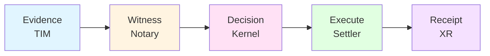
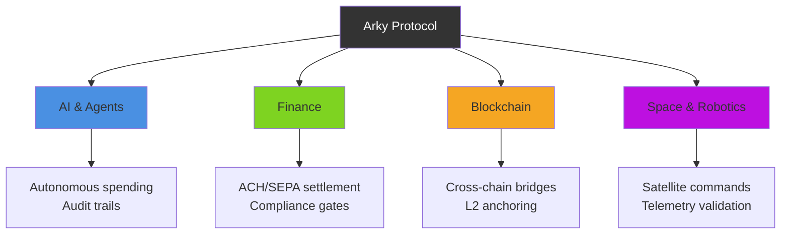
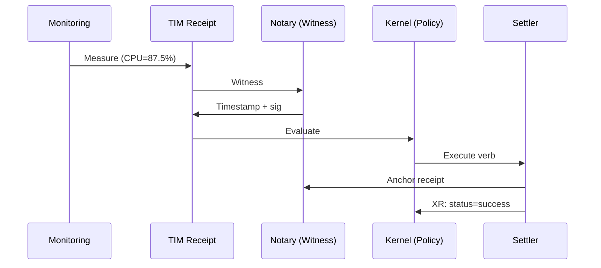

# Arky

Neutral accountability for AI, blockchain, finance, and space.

Open standards for action and verification across agents, money, chains, and machines.

Receipts or it didn’t happen.

## What it is

A minimal protocol that records who acted, with what evidence, under which policy, and what actually happened — so AI agents, financial systems, blockchains, and machines can interoperate safely.

It turns messy, real‑world evidence into deterministic decisions and signed receipts that any rail (bank, blockchain, device) can trust.

See `Mission.md` for the why and vision.

## Core Flow



## Use Cases



## How it works

1. TIM — Cryptographic evidence: who/what/when, signed and content‑addressed
2. Notary — Witness time/order; optionally anchor to chains or logs
3. Kernel — Deterministic decision under declared policy and assertions
4. Settlers — Execute verbs on banks, blockchains, or devices (pay, refund, control, …)
5. Receipt — Signed outcome tied to the decision, rails, and anchors

## Example Flow



## Quick Links
- Start here (Core)
  - `specs/core/ARKY-TIM-v1.md`
  - `specs/core/ARKY-NOTARY-v1.md`
  - `specs/core/ARKY-KERNEL-v1.md`
  - `specs/core/ARKY-SETTLERS-v1.md`
  - `specs/core/ARKY-POLICY-PACKS-v1.md`
- Infrastructure
  - `specs/infrastructure/ARKY-DISCOVERY-v1.md`
  - `specs/infrastructure/ARKY-WIRE-v1.md`
  - `specs/infrastructure/ARKY-MEDIA-TYPES-v1.md`
  - `specs/infrastructure/ARKY-REGISTRIES-v1.md`
- Security
  - `specs/security/ARKY-KEYS-v1.md`
  - `specs/security/ARKY-ATTESTATIONS-v1.md`
  - `specs/security/ARKY-REVOCATIONS-v1.md`
  - `specs/security/ARKY-SECURITY-BPR-v1.md`
- Development
  - `specs/development/ARKY-VECTORS-v1.md`
  - `specs/development/ARKY-EXAMPLES-v1.md`
  - `specs/development/ARKY-SDK-v1.md`
  - `specs/development/ARKY-GLOSSARY-v1.md`
- Schemas: `schemas/`
- Registries: `registries/`
- Vectors: `vectors/`
- Examples: `examples/`
- Governance: `governance/`, RFCs: `rfcs/`

## Implementations

Two independent reference implementations cover the TIM → Kernel → Settler loop
and are cross‑checked **byte‑for‑byte** against each other in CI:

- [`packages/core`](packages/core) — **`@arky/core`** (TypeScript). `npm install`,
  then `generateKeyPair()` + `createTim()` + `verifyTim()`. See its README/quickstart.
- [`packages/core-rs`](packages/core-rs) — **`arky-core`** (Rust). Same loop;
  systems‑language stack for embedded/high‑assurance use.

## Repo Map
- `specs/` — Normative protocol definitions
- `schemas/` — JSON Schemas for validation/codegen
- `registries/` — Signed URN snapshots (units, verbs, rails, devices, attestations)
- `vectors/` — Conformance suites and manifests
- `packages/` — Reference SDKs (TypeScript, Rust)
- `examples/` — Copy‑paste examples and tools
- `governance/` — Versioning, governance policy
- `rfcs/` — Change proposals and templates

## Validation
```sh
bun install
bun run validate
```
Runs JSON syntax, the conformance verifier (recomputes cids, verifies
signatures + witnesses, executes canonicalization/Merkle/idempotency vectors),
Kernel‑vs‑schema, and the link checker. See `CONFORMANCE.md` for exact claims
and per‑check meaning.

## Contribute
- Changes: `CONTRIBUTING.md`
- Conformance: `CONFORMANCE.md`
- Versioning: `governance/VERSIONING.md`
- Security: `SECURITY.md`
- Governance: `governance/ARKY-GOVERNANCE-v1.md`
