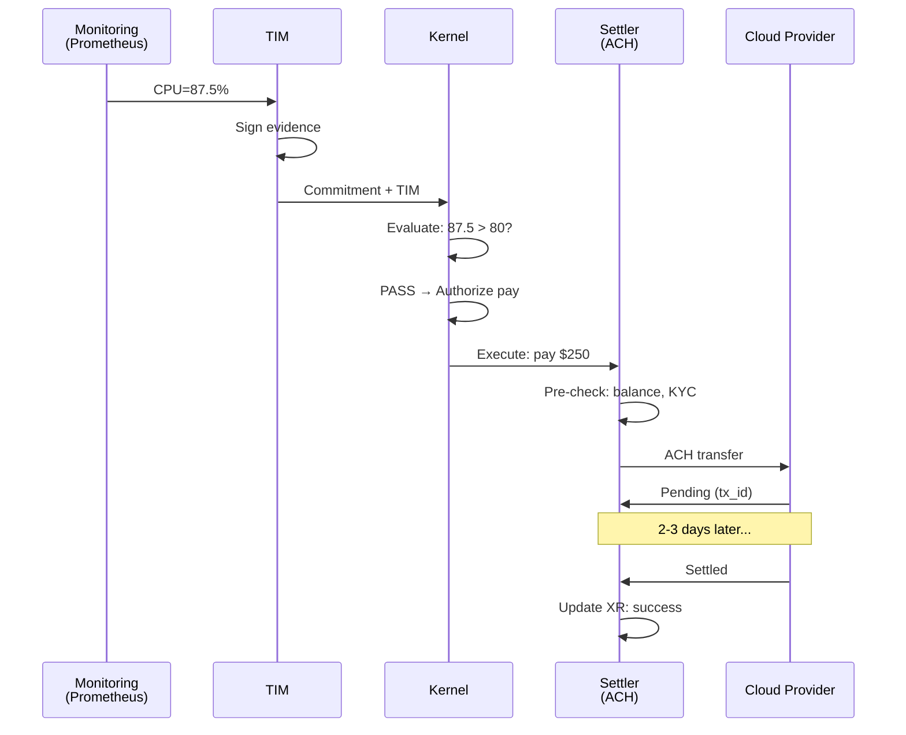

# Cloud Autoscaling Flow Example

Scenario: Automated cloud scaling—pay for compute only if CPU load exceeds threshold.

## 1. TIM Receipt (Evidence)

```json
{
  "time": { "ts": "2025-10-15T14:30:00Z" },
  "identity": { "id": "did:web:monitoring.company.com:rm-01" },
  "measurement": {
    "name": "cpu.utilization",
    "value": 87.5,
    "unit": "%",
    "method": {
      "type": "sensor",
      "source": "prometheus:node_exporter",
      "version": "v2.45"
    }
  },
  "cid": "zQmCPU123...",
  "sig": "eyJhbGciOi..."
}
```

## 2. Kernel Commitment

```json
{
  "scope": "arky:scope/cloud-autoscaling@v1",
  "actor": "did:web:infra.company.com:controller",
  "intent": { "do": "provision_compute", "budget": { "value": 500, "unit": "USD" } },
  "measure": [
    { "name": "cpu_load", "assert": "cpu_load > 80", "window": { "max_age": "PT5M" } }
  ],
  "consequence": [
    {
      "if": "PASS",
      "then": [
        { "name": "arky:verb/pay@v1", "args": { "to": "acct:cloud-provider:billing", "amount": { "value": 250, "unit": "USD" } } }
      ],
      "limits": { "amount_max": { "value": 500, "unit": "USD" } }
    }
  ],
  "cid": "zQmKERNEL456...",
  "sig": "eyJhbGciOi..."
}
```

## 3. Evaluation

Kernel binds `cpu_load = 87.5` from TIM, evaluates:
- `87.5 > 80` → PASS
- Consequence matches: `if: "PASS"`
- Authorizes: `pay` verb with specified args

## 4. Decision (Output)

```json
{
  "kernel_cid": "zQmKERNEL456...",
  "actor": "did:web:infra.company.com:controller",
  "scope": "arky:scope/cloud-autoscaling@v1",
  "status": "APPROVED",
  "assertions": [
    { "name": "cpu_load", "result": "PASS", "inputs": ["zQmCPU123..."] }
  ],
  "authorized": [
    { "name": "arky:verb/pay@v1", "args": { "to": "acct:cloud-provider:billing", "amount": { "value": 250, "unit": "USD" } } }
  ],
  "ts_eval": "2025-10-15T14:30:02Z",
  "cid": "zQmDECISION789...",
  "sig": "eyJhbGciOi..."
}
```

## 5. Execution Request (to Settler)

```json
{
  "request_id": "req_001",
  "commitment_cid": "zQmKERNEL456...",
  "verbs": [
    {
      "verb": "arky:verb/pay@v1",
      "rail": "arky:rail/ach:us@v1",
      "args": { "to": "acct:cloud-provider:billing", "amount": { "value": 250, "unit": "USD" } },
      "deadline": "2025-10-15T15:00:00Z"
    }
  ]
}
```

## 6. Execution Receipt (XR)

```json
{
  "request_id": "req_001",
  "verb": "arky:verb/pay@v1",
  "status": "pending",
  "locator": "ACH20251015T143005-xyz",
  "cost": { "unit": "USD", "value": 2.50 },
  "cid": "zQmXR789...",
  "sig": "eyJhbGciOi..."
}
```

Status evolves: `pending` → `success` after ACH settlement (2-3 business days).

## Flow Diagram



## References

- TIM spec: `specs/core/ARKY-TIM-v1.md`
- Kernel spec: `specs/core/ARKY-KERNEL-v1.md`
- Settlers spec: `specs/core/ARKY-SETTLERS-v1.md`
