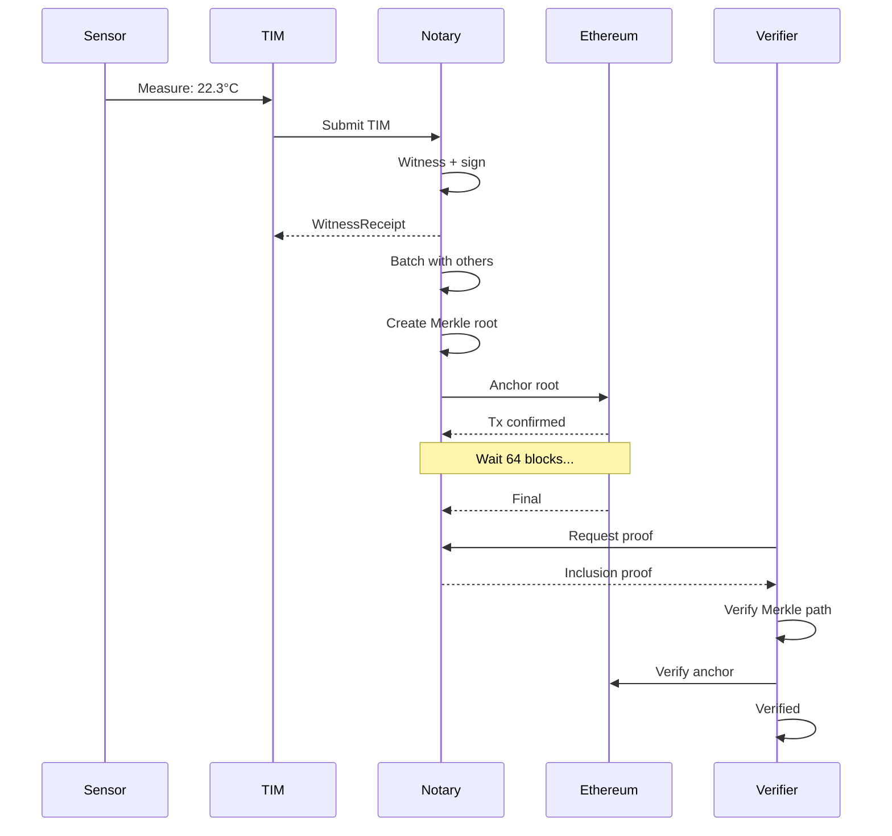

# Notary Witnessing Flow Example

Scenario: Temperature sensor reading witnessed and anchored to Ethereum.

## 1. Submit TIM to Notary

```http
POST /notary/submit HTTP/1.1
Content-Type: application/arky.tim+json

{
  "time": { "ts": "2025-10-15T14:30:00Z" },
  "identity": { "id": "did:web:sensors.example.org:unit-42" },
  "measurement": {
    "name": "temp",
    "value": 22.3,
    "unit": "degC",
    "method": { "type": "sensor", "source": "device:temp-01", "version": "v2" }
  },
  "cid": "zQmABC123...",
  "sig": "eyJhbGciOi..."
}
```

## 2. Notary Response (WitnessReceipt)

```json
{
  "cid": "zQmABC123...",
  "witness_sig": "eyJhbGciOi...",
  "batch_id": "018c-7f9e-b123-8abc",
  "notary_id": "did:web:notary.example",
  "ts": "2025-10-15T14:30:01Z"
}
```

## 3. Batching

Notary batches this TIM with 2 others:
```
cids: [zQmABC123..., zQmDEF456..., zQmGHI789...]
sorted → Merkle tree → root: zQmROOT...
```

## 4. Anchor to Ethereum

```
Tx: 0xabcdef... contains root zQmROOT...
Block: 18123456
Status: pending (depth 0/64)
```

## 5. Finality Check

After 64 blocks:
```
Status: final (depth 64/64)
Anchor confirmed
```

## 6. Get Inclusion Proof

```http
GET /notary/proof?cid=zQmABC123...&batch_id=018c-7f9e-b123-8abc
```

Response:
```json
{
  "cid": "zQmABC123...",
  "batch_root": "zQmROOT...",
  "path": ["zQmDEF456hash", "zQmPARENThash"],
  "anchor": {
    "rail": "caip2:eip155:1",
    "txid": "0xabcdef...",
    "block": 18123456,
    "depth": 64,
    "status": "final"
  },
  "sig": "eyJhbGciOi..."
}
```

## Flow Diagram



## References

- TIM spec: `specs/core/ARKY-TIM-v1.md`
- Notary spec: `specs/core/ARKY-NOTARY-v1.md`
- Translog spec: `specs/core/ARKY-TRANSLOG-v1.md`
