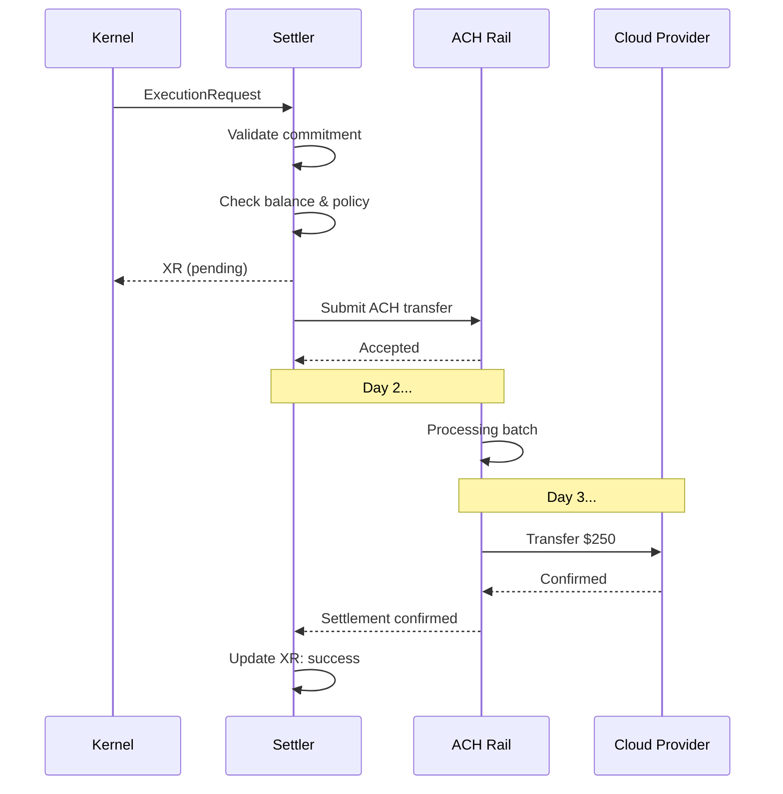

# Settler Execution Flow Example

Scenario: Cloud scaling payment execution on ACH rails.

## 1. Execution Request (from Kernel)

```json
{
  "request_id": "req_001",
  "commitment_cid": "zQmKERNEL456...",
  "verbs": [
    {
      "verb": "urn:arky:verb:pay@v1",
      "rail": "urn:arky:rail:ach:us@v1",
      "args": {
        "to": "acct:cloud-provider:billing",
        "amount": { "value": 250, "unit": "USD" }
      },
      "deadline": "2025-10-15T15:00:00Z"
    }
  ]
}
```

## 2. Settler Processing

Settler validates:
1. Commitment: Verify signature, check referenced TIMs
2. Balance: Check available funds
3. Policy: Verify against policy pack constraints
4. KYC: Validate account status

## 3. Execution Receipt (Initial - Pending)

```json
{
  "request_id": "req_001",
  "verb": "urn:arky:verb:pay@v1",
  "status": "pending",
  "locator": "ACH20251015T143005-xyz",
  "cost": { "unit": "USD", "value": 2.50 },
  "rail_metadata": {
    "rail": "urn:arky:rail:ach:us@v1",
    "batch_id": "20251015_001",
    "expected_settlement": "2025-10-17T09:00:00Z"
  },
  "ts_submitted": "2025-10-15T14:30:05Z",
  "cid": "zQmXR789...",
  "sig": "eyJhbGciOi..."
}
```

## 4. Status Updates

- Day 1 (submission): `{ "status": "pending", "ts": "2025-10-15T14:30:05Z" }`
- Day 2 (processing): `{ "status": "processing", "ts": "2025-10-16T10:00:00Z" }`
- Day 3 (settlement): `{ "status": "success", "ts_settled": "2025-10-17T09:15:23Z", "rail_confirmation": "ACH_CONF_xyz123" }`

## 5. Final Execution Receipt

```json
{
  "request_id": "req_001",
  "verb": "urn:arky:verb:pay@v1",
  "status": "success",
  "locator": "ACH20251015T143005-xyz",
  "cost": { "unit": "USD", "value": 2.50 },
  "rail_metadata": {
    "rail": "urn:arky:rail:ach:us@v1",
    "confirmation": "ACH_CONF_xyz123",
    "settled_at": "2025-10-17T09:15:23Z"
  },
  "ts_submitted": "2025-10-15T14:30:05Z",
  "ts_settled": "2025-10-17T09:15:23Z",
  "cid": "zQmXR789...",
  "sig": "eyJhbGciOi..."
}
```

## Flow Diagram



## Error Scenarios

### Insufficient Funds
```json
{
  "request_id": "req_001",
  "status": "failed",
  "error": {
    "code": "settler.insufficient_funds",
    "detail": "Balance 100 USD, required 252.50 USD (250 amount + 2.50 fee)"
  },
  "ts_failed": "2025-10-15T14:30:06Z"
}
```

### Rollback
```json
{
  "request_id": "req_001",
  "status": "rolled_back",
  "rollback_reason": "Merchant dispute",
  "original_status": "success",
  "ts_rolled_back": "2025-10-18T11:00:00Z"
}
```

## References

- Settlers spec: `specs/core/ARKY-SETTLERS-v1.md`
- Kernel spec: `specs/core/ARKY-KERNEL-v1.md`
- Error Codes: `specs/core/ARKY-ERRORS-v1.md`
