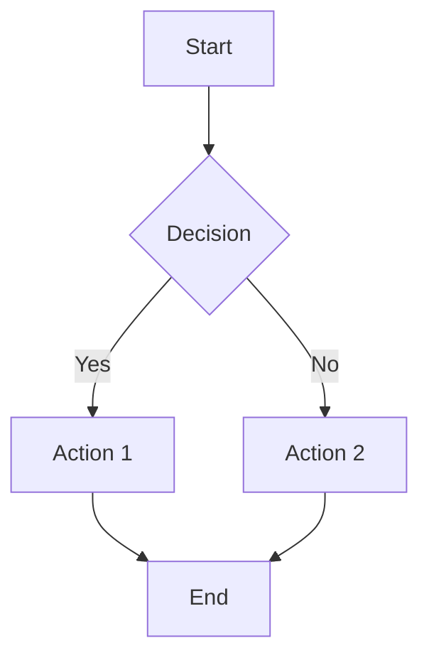

# RFC-XXXX: [Process Change Title]

**Status**: Draft
**Authors**: Your Name <your.email@example.com>
**Tracing**: https://github.com/arky-foundation/arky.foundation/issues/XXX

## Summary
Modify [existing process] to [specific improvement] for [target audience].

## Motivation
### Current Process Issues
What problems exist with the current process?

#### Issue 1: [Problem Description]
**Impact**: How this issue affects stakeholders
**Examples**: Specific instances where this issue caused problems
**Metrics**: Quantifiable impact (if available)

#### Issue 2: [Problem Description]
**Impact**: How this issue affects stakeholders
**Examples**: Specific instances where this issue caused problems
**Metrics**: Quantifiable impact (if available)

### Target Audience
Who will benefit from this process improvement?
- **Developers**: How it helps developers
- **Operators**: How it helps system operators
- **Users**: How it helps end users
- **Maintainers**: How it helps project maintainers

### Success Criteria
How will we know this improvement is successful?
- **Efficiency**: Time saved per task/activity
- **Quality**: Reduction in errors or issues
- **Satisfaction**: User feedback and adoption rates

## Proposal

### New Process Overview
High-level description of the improved process with a flowchart or diagram.



### Detailed Process Steps

#### Step 1: [Step Name]
**Purpose**: What this step accomplishes
**Inputs**: What's needed to start this step
**Outputs**: What this step produces
**Owner**: Who is responsible for this step
**SLA**: Service level agreement or timeline

**Procedure**:
1. Action 1
2. Action 2
3. Action 3

**Success Criteria**: How to verify this step was successful

#### Step 2: [Step Name]
**Purpose**: What this step accomplishes
**Inputs**: What's needed to start this step
**Outputs**: What this step produces
**Owner**: Who is responsible for this step
**SLA**: Service level agreement or timeline

**Procedure**:
1. Action 1
2. Action 2
3. Action 3

**Success Criteria**: How to verify this step was successful

### Role Changes

#### New Roles
```yaml
Role Name:
  Responsibilities:
    - Responsibility 1
    - Responsibility 2
  Required Skills:
    - Skill 1
    - Skill 2
  Reporting: Reports to [Manager/Team]
```

#### Modified Roles
```yaml
Existing Role:
  New Responsibilities:
    - New responsibility 1
    - New responsibility 2
  Removed Responsibilities:
    - Old responsibility 1
  Training Required: [Yes/No]
```

### Tool/Infrastructure Changes

#### New Tools
- **Tool Name**: Purpose and integration points
- **Cost**: Licensing or development cost
- **Timeline**: When tool will be available

#### Modified Tools
- **Tool Name**: Changes required and impact

#### Automation Opportunities
```bash
# Example automation script
#!/bin/bash
# Automated process step

echo "Starting automated process..."
# Automation logic here
echo "Process completed successfully"
```

### Process Examples

#### Before (Current Process)
```bash
# Current process steps
step1_manual_process
step2_manual_verification
step3_manual_deployment
# Time: 2-3 days
# Error rate: 15%
```

#### After (Proposed Process)
```bash
# New improved process
automated_step1
automated_verification
automated_deployment
# Time: 30 minutes
# Error rate: 2%
```

### Decision Matrix

| Situation | Current Process | New Process | Improvement |
|---|---|---|---|
| **Simple Change** | Manual review | Automated approval | 80% time reduction |
| **Complex Change** | Multiple manual steps | Guided workflow | 60% time reduction |
| **Emergency Change** | Bypass process | Fast-track approval | 40% time reduction |

## Compatibility

### Process Disruption
- **Transition Period**: How long to migrate from old to new process
- **Training Required**: What training users will need
- **Tool Dependencies**: New tools or infrastructure needed

### Migration Strategy
#### Phase 1: Pilot (2 weeks)
- **Scope**: Limited to specific team or project type
- **Participants**: Early adopters and process champions
- **Metrics**: Success criteria for pilot evaluation

#### Phase 2: Gradual Rollout (4-6 weeks)
- **Scope**: Expand to additional teams
- **Support**: Enhanced support during transition
- **Feedback**: Continuous improvement based on feedback

#### Phase 3: Full Migration (2 weeks)
- **Scope**: Complete migration to new process
- **Sunset**: Schedule for deprecating old process
- **Documentation**: Update all process documentation

### Backward Compatibility
- **Grace Period**: How long old process remains available
- **Support Level**: Support level for old process during transition
- **Exception Handling**: How to handle exceptions during migration

## Security & Privacy

### Security Considerations
- **Access Control**: New permissions or roles required
- **Audit Trail**: How to audit process execution
- **Data Protection**: Sensitive data handling requirements

### Privacy Implications
- **Data Collection**: New data collected by the process
- **Data Retention**: How long data is retained
- **Compliance**: GDPR or other regulatory considerations

### Risk Assessment
| Risk | Probability | Impact | Mitigation |
|---|---|---|---|
| **Process Failure** | Low | High | Rollback procedures |
| **User Adoption** | Medium | Medium | Training and support |
| **Tool Issues** | Low | Medium | Manual fallback procedures |

## Alternatives

### Alternative 1: [Alternative Approach]
**Description**: Brief description of alternative approach

**Pros**:
- Advantage 1
- Advantage 2

**Cons**:
- Disadvantage 1
- Disadvantage 2

**Cost/Benefit Analysis**: Quantitative comparison

**Reason for Rejection**: Why this approach wasn't chosen

### Alternative 2: [Alternative Approach]
**Description**: Brief description of alternative approach

**Pros**:
- Advantage 1
- Advantage 2

**Cons**:
- Disadvantage 1
- Disadvantage 2

**Cost/Benefit Analysis**: Quantitative comparison

**Reason for Rejection**: Why this approach wasn't chosen

### Alternative 3: Status Quo
**Description**: Keep current process with minor improvements

**Pros**:
- No disruption
- No training required

**Cons**:
- Problems remain unresolved
- No efficiency gains

**Reason for Rejection**: Benefits of proposed change outweigh disruption

## Rollout Plan

### Implementation Timeline

#### Week 1-2: Preparation
- [ ] Finalize process documentation
- [ ] Develop training materials
- [ ] Set up infrastructure/tools
- [ ] Recruit pilot participants

#### Week 3-4: Pilot Program
- [ ] Run pilot with selected team
- [ ] Collect feedback and metrics
- [ ] Refine process based on feedback
- [ ] Evaluate pilot success

#### Week 5-8: Gradual Rollout
- [ ] Expand to additional teams
- [ ] Provide training and support
- [ ] Monitor adoption and performance
- [ ] Address issues as they arise

#### Week 9-10: Full Migration
- [ ] Complete rollout to all teams
- [ ] Decommission old process
- [ ] Finalize documentation
- [ ] Celebrate success

### Resource Requirements

#### Personnel
- **Process Owner**: 0.5 FTE for 3 months
- **Trainers**: 2 people for 1 month
- **Support Staff**: 1 person for 2 months

#### Tools/Infrastructure
- **Tool Name**: License costs, implementation time
- **Training Platform**: Setup and content development

#### Budget
- **Total Cost**: Estimated cost for implementation
- **ROI**: Expected return on investment

### Success Metrics
#### Quantitative Metrics
- **Time Reduction**: Target 50% reduction in process time
- **Error Reduction**: Target 80% reduction in process errors
- **Adoption Rate**: Target 90% adoption within 2 months
- **User Satisfaction**: Target 4.5/5 satisfaction rating

#### Qualitative Metrics
- **User Feedback**: Positive feedback from stakeholders
- **Process Consistency**: More consistent allocation of process
- **Team Morale**: Improved team satisfaction

### Risk Mitigation
| Risk | Mitigation Strategy | Owner | Timeline |
|---|---|---|---|
| **Low Adoption** | Intensive training and support | Process Owner | Week 1-8 |
| **Technical Issues** | Manual fallback procedures | IT Team | Week 1-10 |
| **Budget Overrun** | Regular budget reviews | Finance | Ongoing |

## Testing Strategy

### Process Testing
```yaml
Test Case: Basic Process Flow
Given: A standard change request
When: Following the new process
Then: Change should be completed in target time

Test Case: Exception Handling
Given: An exceptional situation
When: Following the new process
Then: Exception should be handled appropriately
```

### User Acceptance Testing
- **Participants**: Representative users from each role
- **Scenarios**: Real-world process scenarios
- **Success Criteria**: 95% of scenarios completed successfully

### Performance Testing
- **Load Testing**: Test process with multiple concurrent users
- **Stress Testing**: Test process under extreme conditions
- **Volume Testing**: Test process with high volume of requests

## Documentation Requirements

### User Documentation
- **Process Guide**: Step-by-step instructions for users
- **Quick Reference**: One-page summary of key steps
- **FAQ**: Common questions and answers

### Administrator Documentation
- **Process Configuration**: How to configure and maintain the process
- **Troubleshooting Guide**: Common issues and solutions
- **Monitoring Guide**: How to monitor process performance

### Training Materials
- **Training Slides**: Presentation for training sessions
- **Hands-on Exercises**: Practical exercises for users
- **Video Tutorials**: Short videos demonstrating key steps

## References

### Related Processes
- [Current Process Documentation](link to current process)
- [Related Process Changes](link to related RFCs)

### Industry Standards
- [ITIL Process Framework](https://www.axelos.com/itil)
- [DevOps Handbook](https://itrevolution.com/the-devops-handbook/)

### Tools and Resources
- [Tool Documentation](link to tool docs)
- [Best Practice Guides](link to guides)

---

## Review Checklist

### Authors
- [ ] Process flows documented clearly
- [ ] Role responsibilities defined
- [ ] Success criteria established
- [ ] Risk assessment completed

### Process Owners
- [ ] Process feasibility verified
- [ ] Resource requirements confirmed
- [ ] Timeline realistic
- [ ] Migration plan viable

### Stakeholders
- [ ] Impact assessment completed
- [ ] Training needs identified
- [ ] Support requirements defined
- [ ] Buy-in obtained

### Spec WG
- [ ] Process improvement justified
- [ ] Implementation plan approved
- [ ] Resource allocation confirmed
- [ ] Success metrics agreed
