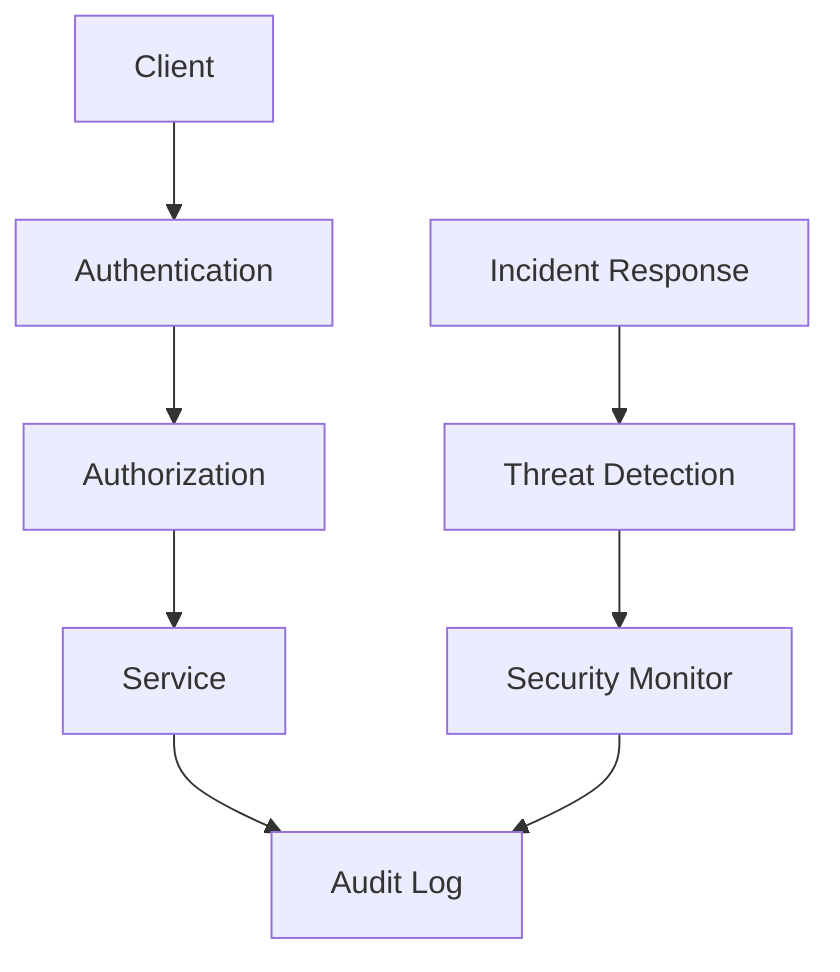

# RFC-XXXX: [Security Improvement Title]

**Status**: Draft
**Authors**: Your Name <your.email@example.com>
**Security Review**: Required
**Tracing**: https://github.com/arky-foundation/arky.foundation/issues/XXX

## Summary
Implement [security feature/improvement] to address [security vulnerability/threat].

## Security Classification
**Classification Level**: Public | Internal | Confidential | Secret
**Security Impact**: High | Medium | Low
**Urgency**: Critical | High | Medium | Low

## Threat Analysis

### Current Threat Landscape
#### Threat 1: [Threat Name]
- **Description**: Detailed description of the threat
- **Attack Vector**: How the threat can be exploited
- **Impact**: Potential damage if exploited
- **Likelihood**: Probability of occurrence (High/Medium/Low)
- **Current Mitigations**: Existing security controls

#### Threat 2: [Threat Name]
- **Description**: Detailed description of the threat
- **Attack Vector**: How the threat can be exploited
- **Impact**: Potential damage if exploited
- **Likelihood**: Probability of occurrence (High/Medium/Low)
- **Current Mitigations**: Existing security controls

### Vulnerability Assessment
#### Vulnerability 1: [CVE/CWE-ID if applicable]
- **Description**: Technical description of vulnerability
- **Affected Components**: List of affected system components
- **Severity Score**: CVSS score or equivalent
- **Exploitability**: How easily it can be exploited
- **Impact Assessment**: Business impact if exploited

#### Vulnerability 2: [CVE/CWE-ID if applicable]
- **Description**: Technical description of vulnerability
- **Affected Components**: List of affected system components
- **Severity Score**: CVSS score or equivalent
- **Exploitability**: How easily it can be exploited
- **Impact Assessment**: Business impact if exploited

## Security Proposal

### Security Architecture Overview


### Security Controls Implementation

#### Control 1: [Control Name]
**Purpose**: What this security control accomplishes
**Type**: Preventive | Detective | Corrective
**Implementation**: Technical details of implementation

```typescript
// Example implementation
class SecurityControl {
  async validate(request: Request): Promise<boolean> {
    // Security validation logic
    const isValid = await this.performSecurityChecks(request);
    return isValid;
  }

  private async performSecurityChecks(request: Request): Promise<boolean> {
    // Detailed security checks
    return this.checkSignature(request) &&
           this.checkTimestamp(request) &&
           this.checkPermissions(request);
  }
}
```

**Configuration**:
```json
{
  "security_control": {
    "enabled": true,
    "parameters": {
      "max_attempts": 3,
      "lockout_duration": 900,
      "audit_level": "detailed"
    }
  }
}
```

#### Control 2: [Control Name]
**Purpose**: What this security control accomplishes
**Type**: Preventive | Detective | Corrective
**Implementation**: Technical details of implementation

### Cryptographic Improvements

#### Algorithm Updates
- **Current Algorithm**: Description of current algorithm and weaknesses
- **Proposed Algorithm**: Description of new algorithm and benefits
- **Migration Strategy**: How to transition from old to new algorithm

```typescript
// Example cryptographic implementation
class CryptoProvider {
  async encrypt(data: Buffer, key: CryptoKey): Promise<Buffer> {
    // New encryption algorithm implementation
    const algorithm = {
      name: 'AE-GCM',
      iv: crypto.getRandomValues(new Uint8Array(12)),
      tagLength: 128
    };

    return await crypto.subtle.encrypt(algorithm, key, data);
  }
}
```

#### Key Management
- **Key Generation**: How keys are generated and managed
- **Key Rotation**: Key rotation schedule and procedures
- **Key Storage**: Secure key storage mechanisms

### Authentication & Authorization

#### Authentication Improvements
```typescript
// Enhanced authentication
interface AuthenticationResult {
  success: boolean;
  user: User | null;
  token: string | null;
  expiresAt: Date | null;
  mfaRequired: boolean;
}

class AuthenticationService {
  async authenticate(credentials: Credentials): Promise<AuthenticationResult> {
    // Multi-factor authentication
    const primaryAuth = await this.validateCredentials(credentials);
    if (!primaryAuth.success) return primaryAuth;

    const mfaResult = await this.validateMFA(credentials.mfaToken);
    return {
      ...primaryAuth,
      ...mfaResult
    };
  }
}
```

#### Authorization Model
```yaml
# Role-based access control
roles:
  admin:
    permissions:
      - read:all
      - write:all
      - delete:all

  user:
    permissions:
      - read:own
      - write:own

  viewer:
    permissions:
      - read:public
```

### Monitoring & Detection

#### Security Monitoring
```typescript
// Security event monitoring
interface SecurityEvent {
  id: string;
  type: 'authentication' | 'authorization' | 'data_access';
  severity: 'low' | 'medium' | 'high' | 'critical';
  timestamp: Date;
  userId?: string;
  resource: string;
  action: string;
  result: 'success' | 'failure';
  metadata: Record<string, any>;
}

class SecurityMonitor {
  async detectThreats(events: SecurityEvent[]): Promise<ThreatAlert[]> {
    // Threat detection logic
    return events
      .filter(event => this.isSuspicious(event))
      .map(event => this.createThreatAlert(event));
  }

  private isSuspicious(event: SecurityEvent): boolean {
    // Suspicious activity detection
    return event.type === 'authentication' &&
           event.result === 'failure' &&
           this.hasMultipleFailures(event.userId);
  }
}
```

#### Incident Response
```yaml
Incident Response Plan:
  Detection:
    - Automated monitoring
    - Security alerting
    - Log analysis

  Containment:
    - Isolate affected systems
    - Block malicious IPs
    - Disable compromised accounts

  Eradication:
    - Remove malware
    - Patch vulnerabilities
    - Update security controls

  Recovery:
    - Restore systems
    - Verify security
    - Monitor for recurrence
```

## Compatibility

### Security Impact Assessment
- **Breaking Changes**: List any breaking security changes
- **Migration Requirements**: Security migration procedures
- **Backward Compatibility**: How to maintain compatibility

### Performance Impact
- **Overhead**: Security control performance overhead
- **Latency**: Added latency measurements
- **Resource Usage**: Additional resource requirements

### Integration Impact
- **API Changes**: Security-related API changes
- **Client Updates**: Required client updates
- **Third-party Dependencies**: Impact on external integrations

## Security Testing

### Penetration Testing
```yaml
Penetration Test Plan:
  Scope:
    - Authentication systems
    - API endpoints
    - Data storage
    - Network communications

  Test Types:
    - Black-box testing
    - White-box testing
    - Gray-box testing

  Test Scenarios:
    - Authentication bypass
    - Privilege escalation
    - Data exfiltration
    - Denial of service
```

### Security Testing Framework
```typescript
// Security testing utilities
class SecurityTester {
  async testAuthenticationBypass(): Promise<TestResult> {
    // Test for authentication bypass vulnerabilities
    const attempts = [
      this.testSQLInjection(),
      this.testXXE(),
      this.testCSRF(),
      this.testSessionHijacking()
    ];

    return Promise.all(attempts);
  }

  async testDataExfiltration(): Promise<TestResult> {
    // Test for data exfiltration vulnerabilities
    return {
      passed: await this.validateDataAccess(),
      issues: await this.identifyDataLeaks()
    };
  }
}
```

### Vulnerability Scanning
```bash
# Automated vulnerability scanning
#!/bin/bash
# Security scan pipeline

echo "Starting security vulnerability scan..."

# Static code analysis
safety check
bandit -r ./

# Dependency vulnerability scan
npm audit
snyk-audit

# Container security scan
trivy image arky:latest

# Network security scan
nmap -sS -O target-host

echo "Security scan completed"
```

## Alternatives

### Alternative Security Approaches

#### Option 1: [Alternative Security Solution]
**Description**: Brief description of alternative security approach

**Security Benefits**:
- Benefit 1
- Benefit 2

**Drawbacks**:
- Drawback 1
- Drawback 2

**Cost/Benefit Analysis**: Security ROI calculation

**Reason for Rejection**: Why this approach wasn't chosen

#### Option 2: [Alternative Security Solution]
**Description**: Brief description of alternative security approach

**Security Benefits**:
- Benefit 1
- Benefit 2

**Drawbacks**:
- Drawback 1
- Drawback 2

**Cost/Benefit Analysis**: Security ROI calculation

**Reason for Rejection**: Why this approach wasn't chosen

### Risk Acceptance
**Description**: Accept current security risks without implementing changes

**Risk Analysis**:
- **Annual Loss Expectancy**: $XXX
- **Implementation Cost**: $YYY
- **ROI Calculation**: Analysis of cost vs. benefit

**Reason for Rejection**: Risk exceeds acceptable threshold

## Rollout Plan

### Security Implementation Timeline

#### Phase 1: Design & Development (4-6 weeks)
- [ ] Security architecture design
- [ ] Security control implementation
- [ ] Security testing framework
- [ ] Documentation development

#### Phase 2: Testing & Validation (2-3 weeks)
- [ ] Penetration testing
- [ ] Vulnerability assessment
- [ ] Security code review
- [ ] Performance impact testing

#### Phase 3: Deployment (2-3 weeks)
- [ ] Staged deployment
- [ ] Security monitoring setup
- [ ] Incident response procedures
- [ ] Team training

#### Phase 4: Monitoring & Optimization (Ongoing)
- [ ] Continuous security monitoring
- [ ] Threat intelligence integration
- [ ] Security metrics tracing
- [ ] Regular security assessments

### Resource Requirements

#### Security Team
- **Security Architect**: 1 FTE for 8 weeks
- **Security Engineer**: 1 FTE for 6 weeks
- **Penetration Tester**: Contract for 2 weeks

#### Tools & Infrastructure
- **Security Tools**: [Tool list and costs]
- **Monitoring Infrastructure**: Setup and configuration
- **Training Programs**: Security awareness training

### Success Metrics

#### Security Metrics
- **Vulnerability Reduction**: Target 90% reduction in critical vulnerabilities
- **Incident Response Time**: Target < 1 hour for critical incidents
- **Security Compliance**: 100% compliance with security standards
- **False Positive Rate**: Target < 5% for security alerts

#### Business Metrics
- **Risk Reduction**: Target 80% reduction in security risk
- **Compliance Score**: Target industry-leading compliance score
- **Security Awareness**: Target 95% staff security awareness

## Security Documentation

### Security Policies
- **Acceptable Use Policy**: Updated policy reflecting new controls
- **Data Classification Policy**: Data handling procedures
- **Incident Response Policy**: Security incident procedures

### Technical Documentation
- **Security Architecture**: Detailed security design documents
- **Configuration Guides**: Security configuration procedures
- **Troubleshooting Guides**: Security issue resolution

### Training Materials
- **Security Awareness Training**: Staff training program
- **Developer Security Training**: Secure coding practices
- **Incident Response Training**: Response team training

## References

### Security Standards
- [NIST Cybersecurity Framework](https://www.nist.gov/cyberframework)
- [OWASP Top 10](https://owasp.org/www-project-top-ten/)
- [ISO 27001](https://www.iso.org/isoiec-27001-information-security.html)

### Security Resources
- [CVE Database](https://cve.mitre.org/)
- [NIST Vulnerability Database](https://nvd.nist.gov/)
- [Security Blogs and Forums](https://example.com)

### Related RFCs
- [RFC-XXXX](../XXXX-security-rfc.md) - Related security improvement

---

## Security Review Checklist

### Security Team
- [ ] Threat model completed
- [ ] Vulnerability assessment done
- [ ] Security controls designed
- [ ] Incident response procedures defined

### Development Team
- [ ] Secure coding practices followed
- [ ] Security testing implemented
- [ ] Code security review completed
- [ ] Security documentation updated

### Operations Team
- [ ] Deployment procedures secured
- [ ] Monitoring and alerting configured
- [ ] Backup and recovery procedures tested
- [ ] Security incident response trained

### Spec WG
- [ ] Security improvements justified
- [ ] Risk assessment acceptable
- [ ] Implementation feasible
- [ ] Resources allocated
