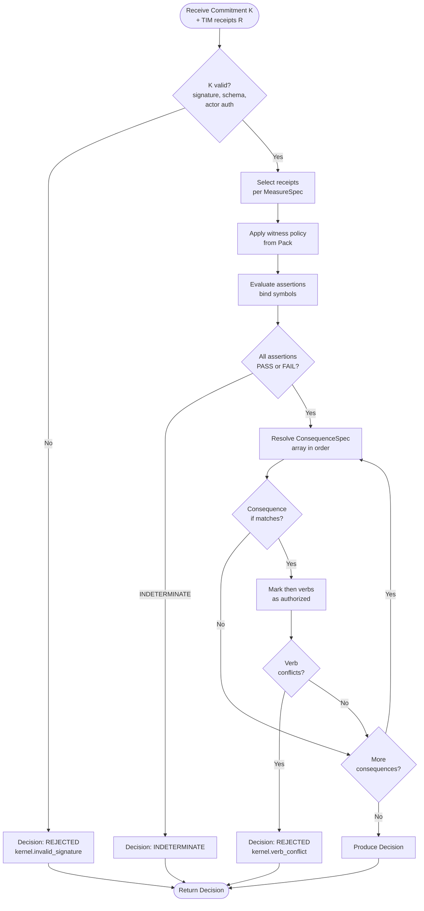

---

spec_id: ARKY-KERNEL-v1
title: Arky — Kernel
version: v1
status: review
effective: 2025-10-15
doc_type: specification
normative_default: true  # all sections normative unless labeled Informative
depends_on:
  - ARKY-TIM-v1
  - ARKY-TIM-Canonicalization-v1
  - ARKY-NOTARY-v1
  - ARKY-SETTLERS-v1
  - ARKY-ASSERTIONS-v1
  - ARKY-TIM-Profiles-v1
  - ARKY-POLICY-PACKS-v1
  - ARKY-REGISTRIES-v1
  - ARKY-ERRORS-v1
summary: >
  Defines the minimal, verifiable commitment format and evaluation semantics that
  bind identity, evidence (TIM), and consequences, with deterministic decisions
  and rail-agnostic execution.
links:
  tim: https://arky.foundation/specs/core/ARKY-TIM-v1
  canonicalization: https://arky.foundation/specs/core/ARKY-TIM-Canonicalization-v1
  notary: https://arky.foundation/specs/core/ARKY-NOTARY-v1
  settlers: https://arky.foundation/specs/core/ARKY-SETTLERS-v1
  profiles: https://arky.foundation/specs/core/ARKY-TIM-Profiles-v1
  policy_packs: https://arky.foundation/specs/core/ARKY-POLICY-PACKS-v1
  registries: https://arky.foundation/specs/infrastructure/ARKY-REGISTRIES-v1
  errors: https://arky.foundation/specs/core/ARKY-ERRORS-v1
  vectors: https://arky.foundation/vectors/
  rfcs: https://arky.foundation/rfcs/
references:
  - RFC 2119  # Normative Keywords
  - RFC 8785  # JSON Canonicalization Scheme (JCS)
  - ISO 8601  # Date/Time
  - BCP 47    # Language Tags
governance:
  owner: Arky Foundation Technical Council
  process: RFC with public review and test vectors
authors:
  - Arky Foundation Dev WG
license:
  text: CC-BY-4.0
  code: Apache-2.0
permalink: /specs/core/ARKY-KERNEL-v1
last_updated: 2025-10-15

---

# Arky — Kernel (v1)

spec ID: ARKY-KERNEL-v1
Effective: 2025-10-15

**All sections are normative unless labeled *Informative*.** The Kernel specifies a compact commitment object, a small assertion language, and deterministic decision semantics that consume TIM receipts and authorize execution via Settlers.

---

## 1. Scope

* Applies to commitments that reference **TIM** evidence and request **Consequences** on one or more rails.
* Defines: data model, assertion language, evaluation algorithm, decision artifact, safety invariants, interfaces, and conformance.
* Out of scope: UI, domain-specific business logic, oracles beyond TIM, and proprietary settlement rules.


> **Complete Example:** See [Cloud Auto-scaling Flow](../../examples/flows/cloud-autoscaling.md) for a full end-to-end example.

---

## 2. Terminology

* **Commitment:** A signed Kernel object declaring an intended action, required evidence, and consequences.
* **Actor:** Identity authorized to issue/accept the Commitment (human/org/agent/robot).
* **Scope:** Named context (contract/treaty/policy) that governs upgrades, disputes, and defaults.
* **MeasureSpec:** Requirement describing *what evidence counts*, expressed over TIM fields.
* **Assertion:** Boolean condition evaluated from evidence (true/false/unknown).
* **Consequence:** Action verbs to execute via Settlers if assertions resolve to specific outcomes.
* **Clock:** Ordering and notarization anchors used for deadlines and finality.
* **Decision:** Signed result of evaluation, listing satisfied assertions and authorized consequences.

---

## 3. Data Model

A Kernel Commitment **MUST** be signed and content‑addressed using the same
rules as TIM: JCS (RFC 8785) canonical body excluding `cid`/`sig`, `cid` as the
multibase/base58btc multihash (see ARKY-TIM-v1 §5), and a **detached-payload**
JWS Ed25519 `sig` (RFC 7797, `b64:false`; see ARKY-TIM-v1 §6). Fields marked
*required* are mandatory.

```typescript
Kernel :=
  scope:        string,                    // *required* — stable identifier
  actor:        string,                    // *required* — identity id (maps to TIM identity methods)
  intent:       Intent,                    // *required*
  measure:      [MeasureSpec],             // *required* — non-empty
  consequence:  [ConsequenceSpec],         // *required* — non-empty
  clock?:       ClockSpec,                 // optional notarization/deadline hints
  policy?:      PolicyHints,               // optional safety knobs (limits, approvals)
  locale?:      string,                    // BCP 47 (for messages only)
  prev?:        string,                    // optional journal pointer (cid)
  cid:          string,                    // *required* — content id (multihash)
  nonce?:       string,                    // replay protection
  exp?:         string,                    // RFC3339 deadline for acceptance
  sig:          string                     // *required* — JWS Ed25519 over canonical body

```

**Intent**

```typescript
Intent :=
  do:           string,                    // *required* — semantic label (extensible registry)
  budget?:      Amount,                    // optional: max value exposed to settlers
  rate?:        string,                    // ISO 8601 duration for periodic intents (e.g., PT1H)
  geofence?:    string,                    // region label or polygon id (policy-defined)
  approvals?:   [string]                   // list of approver ids (two-person control)

```

**MeasureSpec**

```typescript
MeasureSpec :=
  name:         string,                    // *required* — semantic label
  from?:        string,                    // source hint (e.g., ros2:/topic, fhir:lab, oracle:id)
  window?:       start?: string, end?: string, max_age?: string , // RFC3339/ISO8601 durations
  assert:       Expr,                      // *required* — assertion language expression
  profile?:     string,                    // optional TIM profile id (e.g., TIM-AI-v1)
  require?:                               // optional hard requirements on receipts
                   min_witnesses?: number,
                   device_class?: [string],
                   code?: [string]         // domain codes (LOINC, etc.)


```

**ConsequenceSpec**

```typescript
ConsequenceSpec :=
  if:           Outcome,                   // *required* — PASS | FAIL | INDETERMINATE | expr
  then:         [Verb],                    // *required* — one or more settler verbs
  limits?:      Limits                     // optional: caps and expiry per verb set


Verb :=
  name:         string,                    // *required* — settler verb URN (e.g., arky:verb/pay@v1)
  args:         object                     // *required* — verb-specific arguments


Limits :=
  amount_max?:  Amount,
  retries_max?: number,
  expiry?:      string                     // RFC3339 absolute


Outcome := "PASS" | "FAIL" | "INDETERMINATE" | Expr   // Expr returns boolean
```

**ConsequenceSpec.if semantics:**

**Literal outcomes** (most common):
```json
 "if": "PASS", "then": [...]           // Execute if ALL assertions pass
 "if": "FAIL", "then": [...]           // Execute if ANY assertion fails
 "if": "INDETERMINATE", "then": [...]  // Execute if ANY assertion is indeterminate
```

**Expression outcomes** (advanced):
```json
// Reference specific assertion results
 "if": "temp_check == PASS && pressure_check == PASS", "then": [...]

// Boolean logic
 "if": "!(manual_override == FAIL)", "then": [...]

// Combine with literals
 "if": "safety_check == PASS || emergency_mode", "then": [...]
```

**Expression symbols:**
- Each `MeasureSpec.name` creates both:
  - A **value symbol** (e.g., `temp` → 22.3) for use in `MeasureSpec.assert`
  - A **result symbol** (e.g., `temp_check` → PASS/FAIL/INDETERMINATE) for use in `ConsequenceSpec.if`
- Result symbols always end with `_result` or match the assertion name

**Examples:**
```typescript
// Simple: if all pass, execute payment
 "if": "PASS", "then": [ "name": "arky:verb/pay@v1", "args": ... ]

// Conditional: different verbs for pass vs fail
[
   "if": "PASS", "then": [ "name": "arky:verb/pay@v1", ...] ,
   "if": "FAIL", "then": [ "name": "arky:verb/notify@v1", ...]
]

// Complex: multi-assertion logic

  "if": "temp_check == PASS && (pressure_check == PASS || manual_override == true)",
  "then": [ "name": "arky:verb/activate@v1", ...]


// Fallback: catch indeterminate state
 "if": "INDETERMINATE", "then": [ "name": "arky:verb/escalate@v1", ...]
```

**ClockSpec**

```typescript
ClockSpec :=
  notarize?:    [string],                  // anchor targets (e.g., caip2:eip155:1)
  deadline?:    string,                    // RFC3339; decision must occur by this time
  ordering?:     lamport?: number        // offline ordering hint

```

**PolicyHints**

```typescript
PolicyHints :=
  rollback_window?:  string,               // ISO 8601 duration
  two_person?:       boolean,
  quarantine_skew?:  string                // max tolerated ts skew before quarantine

```

**Amount**

```typescript
Amount :=  value: number, unit: string   // e.g.,  value: 40, unit: "USD"  or CAIP-19 asset units
```

---

## 4. Assertion Language

`assert` **MUST** be a boolean expression with tri-valued result: **PASS** (true), **FAIL** (false), **INDETERMINATE** (cannot evaluate).

**Tri-state semantics:** see `specs/core/ARKY-ASSERTIONS-v1.md` §8.1 for complete Kleene three-valued logic truth tables and evaluation rules.

### 4.1 Syntax & Operators

**Grammar:**
```ebnf
Expr       ::= Comparison | LogicalExpr | "(" Expr ")"
Comparison ::= Symbol Op Value
             | Symbol "in" "[" ValueList "]"
LogicalExpr::= Expr ("&&" | "||") Expr
             | "!" Expr
Op         ::= "<" | "<=" | ">" | ">=" | "==" | "!="
Symbol     ::= [a-z_][a-z0-9_]*          // matches MeasureSpec.name
Value      ::= Number | String | Boolean
ValueList  ::= Value ("," Value)*
Number     ::= [0-9]+ ("." [0-9]+)?
String     ::= '"' [^"]* '"'
Boolean    ::= "true" | "false"
```

**Supported operations:**
- Arithmetic comparisons: `<`, `<=`, `>`, `>=`, `==`, `!=`
- Logical operators: `&&` (AND), `||` (OR), `!` (NOT)
- Set membership: `in [...]`

**Examples:**
```typescript
"temp < 25"                              // Simple comparison
"temp >= 20 && temp <= 30"               // Range check
"status == "ok""                       // String equality
"pressure > 100 || manual_override"      // Logical OR
"!(temp > 50)"                           // Negation
"error_code in [0, 1, 2]"                // Set membership
```

**Type coercion:**
- If TIM `measurement.value` is string but assertion uses numeric comparison → INDETERMINATE
- If units mismatch (e.g., comparing °C to °F) → INDETERMINATE (unless unit conversion registered)
- Missing symbols (no matching receipts) → INDETERMINATE

**Unit handling:**
All symbols inherit units from TIM `measurement.unit`. Comparisons **MUST** be unit-compatible:
- `temp < 25` where temp has unit `degC` → valid
- `temp < weight` where units differ → INDETERMINATE

**Extensibility:**
Implementations **MAY** support additional functions if registered in ARKY-REGISTRIES-v1:
- `avg(symbol, duration)` - average over time window
- `min(symbol)`, `max(symbol)` - aggregations
- `count(symbol)` - number of matching receipts

Note: Full expression language specification (ARKY-ASSERTIONS-v1) is defined separately.

### 4.2 Evaluation Semantics

**Symbol Binding:** For each `MeasureSpec` with `name: "foo"`, the evaluator **MUST** bind a symbol `foo` to TIM receipt data:

**Binding modes:**

**1. Latest value (default)**
```typescript
// If multiple TIMs match, use the most recent by Notary ordering
const temp = latestTIM(matchingReceipts).measurement.value;
```

**2. All values (if assertion uses aggregation)**
```typescript
// For functions like avg(), min(), max()
const temps = matchingReceipts.map(t => t.measurement.value);
```

**3. Boolean flag (if TIM existence check)**
```typescript
// For assertions like "sensor_online"
const sensor_online = matchingReceipts.length > 0;
```

**Selection algorithm:**
1. Filter all TIM receipts by:
   - `MeasureSpec.profile` (if specified)
   - `MeasureSpec.require.min_witnesses` (count `time.witnesses[]`)
   - `MeasureSpec.require.device_class` (match `measurement.device`)
   - `MeasureSpec.require.code` (match `measurement.code`)
   - `MeasureSpec.window` (see §4.3)
2. Sort by Notary ordering tuple: `(time.ts ASC, time.ordering.lamport ASC, identity.id ASC, cid ASC)`
3. Bind symbol to latest `measurement.value` (or array for aggregations)

**Profile validation:**
- If `MeasureSpec.profile` is specified, Kernel **MUST** validate matching TIMs against constraints from [ARKY-TIM-Profiles-v1](ARKY-TIM-Profiles-v1.md)
- Profile validation rules (see ARKY-TIM-Profiles-v1 §4):
  - **Required fields:** Check that profile-mandated fields exist (e.g., AI profile requires `train_compute`)
  - **Unit constraints:** Verify units match profile specifications (e.g., `train_compute` must use `TFLOP·h`)
  - **Value ranges:** Validate numeric values fall within allowed ranges
- If TIM fails profile validation → exclude from matching receipts (treated as if no match)
- Error handling: If ALL candidate TIMs fail profile validation → symbol is **undefined** → assertion result is **INDETERMINATE**

**Missing data:**
- If no TIMs match → symbol is **undefined** → assertion result is **INDETERMINATE**
- Exception: If `MeasureSpec.require.min_witnesses = 0` (optional), symbol may be null/undefined and assertion handles it

**Type mapping:**
| TIM measurement.value | Symbol type | Notes                          |
|-----------------------|-------------|--------------------------------|
| number                | number      | Carries unit from TIM          |
| string                | string      | For status/enum values         |
| boolean               | boolean     | For binary states              |
| object                | object      | For structured data (advanced) |

**Example:**
```json
// MeasureSpec
 "name": "temp", "from": "sensor:datacenter", "window":  "max_age": "PT5M"

// Matching TIMs (2 found)
[
   "cid": "z1", "time":  "ts": "2025-10-15T14:25:00Z" , "measurement":  "value": 21.5, "unit": "degC" ,
   "cid": "z2", "time":  "ts": "2025-10-15T14:30:00Z" , "measurement":  "value": 22.3, "unit": "degC"
]

// Binding (latest)
temp = 22.3  // from z2 (most recent)
```

**Window Semantics:** `window` filters TIMs by time:

1. **Explicit range** (highest priority):
   ```json
    "start": "2025-10-15T14:00:00Z", "end": "2025-10-15T15:00:00Z"
   ```
   Include TIMs where `start <= time.ts < end`.

2. **Relative age**:
   ```json
    "max_age": "PT5M"   // ISO 8601 duration
   ```
   Include TIMs where `evaluation_time - time.ts <= max_age`.

3. **Combined** (both must be satisfied):
   ```json
    "start": "2025-10-15T14:00:00Z", "max_age": "PT1H"
   ```
   TIM must be after `start` AND within `max_age` of evaluation time.

4. **No window** (default):
   No time filtering; consider all TIMs.

**Edge cases:**
- `max_age: "PT0S"` → only TIMs with exact timestamp match (rarely useful)
- `start` without `end` → all TIMs after start
- `end` without `start` → all TIMs before end

---

## 5. Evaluation Algorithm

Given: Commitment `K`, set `R` of candidate TIM receipts, and Policy Pack (optional).

**Policy Pack Enforcement:**
- Policy Packs are **optional** constraints that MAY be provided via `policy_pack_id` in the Commitment or deployment configuration
- If NO Policy Pack is specified, Kernel uses default behavior: no witness minimums, no finality requirements, no rollback constraints
- If a Policy Pack IS specified, Kernel **MUST** enforce constraints from [ARKY-POLICY-PACKS-v1 §6](ARKY-POLICY-PACKS-v1.md):
  - `witness_policy.min_witnesses` — applied during receipt selection (step 2)
  - `limits.amount_caps` — validated before authorizing verbs (step 4)
  - `limits.two_person_control` — checked in §7.1 two-person approval
- Notary and Settler also enforce their respective Pack constraints independently (see their specs)



**Steps:**

1. **Validate K**: schema, signature, expiry, actor authorization, scope rules.
2. **Select receipts**: for each `MeasureSpec`, filter `R` by `profile`/`require`/`window`; apply witness policy from Pack.
3. **Evaluate assertions**: compute tri‑valued results per `MeasureSpec`. Selection and evaluation order **MUST** follow the Notary tuple: `(time.ts ASC, time.ordering.lamport ASC (missing=0), identity.id ASC (bytewise), cid ASC (bytewise))`.
4. **Resolve outcome**: for each `ConsequenceSpec` in order, if `if` matches (literal or boolean Expr), mark its `then` as **authorized**.
5. **Detect conflicts**: See §5.1.
6. **Produce Decision** (see §6).
7. **Execute** (out of scope here): pass authorized `then` verbs and `limits` to appropriate Settlers.

### 5.1 Verb Conflict Resolution

**Conflict:** Two verbs operating on the same resource incompatibly (e.g., `pay(alice, $10)` and `pay(alice, $20)`).

**Detection:** Check resource identifiers from `args` and consult ARKY-REGISTRIES-v1 conflict declarations.

**Resolution modes:**
1. **First-match wins (default):** Evaluate `ConsequenceSpec` array in order; first match wins, ignore subsequent.
2. **Combine mode:** If `policy.combine: true`, accumulate non-conflicting verbs.
3. **Explicit priority:** Use `priority: number` field (higher wins).

**Error:** If conflict detected → `kernel.verb_conflict`, status → `REJECTED`.

---

## 6. Decision Artifact

Evaluators **MUST** emit a signed Decision object.

```typescript
Decision :=
  kernel_cid:   string,                    // *required* — cid of evaluated Kernel
  actor:        string,                    // *required*
  scope:        string,                    // *required*
  status:       DecisionStatus,            // *required* — evaluation outcome
  assertions:   [ AssertionResult ],
  authorized:   [ Verb ],                  // settler verbs allowed to execute (if status=APPROVED)
  ts_eval:      string,                    // RFC3339 evaluation timestamp
  cid:          string,                    // content id of canonical Decision body
  sig:          string                     // JWS Ed25519


DecisionStatus := "APPROVED"               // All checks passed, verbs authorized
                | "REJECTED"               // Assertions failed or policy denied
                | "INDETERMINATE"          // Cannot evaluate (missing evidence)
                | "PENDING_APPROVAL"       // Awaiting two-person approvals
                | "EXPIRED"                // Past Commitment.exp deadline

AssertionResult :=
  name:         string,                    // matches MeasureSpec.name
  result:       "PASS"|"FAIL"|"INDETERMINATE",
  inputs:       [string],                  // TIM cids used
  error?:       string                     // if INDETERMINATE, explain why

```

**Status transitions:**
```text
PENDING_APPROVAL → APPROVED (all approvals collected) → [verbs executed]
                → REJECTED (approval denied)

APPROVED → REJECTED (assertions fail or policy violation)
         → INDETERMINATE (missing evidence)

EXPIRED → terminal state (no transitions)
```

**Requirements:**
* Decision **MUST** list the exact TIM `cid`s that influenced each assertion.
* Decision **MUST** be JCS‑canonicalized, content‑addressed, and signed with a detached-payload JWS like TIM (see ARKY-TIM-v1 §5–§6).
* If `status = APPROVED`, `authorized` **MUST** contain at least one verb.
* If `status != APPROVED`, `authorized` **SHOULD** be empty (no execution).
* `AssertionResult.error` **SHOULD** explain INDETERMINATE (e.g., "no matching receipts", "unit mismatch").

---

## 7. Safety & Security

Implementations **MUST** enforce:

* **Least authority**: verbs cannot exceed `intent.budget` or `limits`.
* **Rollback windows**: respect Pack or `policy.rollback_window` when coordinating with Settlers.
* **Quarantine**: receipts with excessive clock skew are excluded unless corroborated per Pack.
* **Immutability**: all inputs/outputs are content‑addressed and signed.

### 7.1 Two-Person Approval

When `intent.approvals` is present, the Kernel **MUST** enforce multi-party approval before authorizing verbs.

**Data model:**
```typescript
Intent :=
  ...
  approvals?: [string]  // array of approver identity IDs


// Separate approval object (submitted alongside or after Commitment)
Approval :=
  kernel_cid: string,           // *required* — cid of Commitment being approved
  approver: string,             // *required* — approver identity.id
  decision: "approve"|"reject", // *required*
  ts: string,                   // *required* — RFC3339 timestamp
  cid: string,                  // *required* — content id of canonical Approval
  sig: string                   // *required* — JWS Ed25519 over canonical Approval

```

**Flow:**
1. Commitment with `intent.approvals: ["did:web:alice", "did:web:bob"]` enters **PENDING_APPROVAL**
2. Each approver submits signed `Approval` object
3. Kernel verifies: signature valid, approver in list, distinct identities
4. Once all approve → evaluation proceeds; any reject → blocked

**Requirements:**
- Approver keys resolvable per ARKY-TIM-v1 §6.1
- Approvals reference exact `kernel_cid`
- No self-approval (actor cannot be sole approver)

**Errors:** `kernel.approval_missing`, `common.forbidden`, `kernel.invalid_signature`

---

## 8. Interfaces

Minimal HTTP/gRPC endpoints **MUST** be provided by Kernel evaluators.

* **Evaluate** `POST /kernel/evaluate`
  Input: ` kernel, receipts: [TIM...], policy_pack_id?, mode?: "dry_run"|"production" `
  Output: ` decision `. Errors: See §8.1.

* **Decision** `GET /kernel/decision/:cid`
  Output: Decision by `cid`. Errors: See §8.1.

* **Policy** `GET /kernel/policy`
  Output: effective defaults (read‑only). Errors: See §8.1.

**All error responses MUST use ARKY-ERRORS-v1 Error Envelope.**

Auth is deployment‑specific; out of scope.

### 8.1 Error Codes

Kernel operations **MUST** return errors using ARKY-ERRORS-v1 with the following codes:

**Validation errors:**
- `common.invalid_argument` — Malformed request body
- `kernel.invalid_commitment` — Commitment schema validation failed
- `kernel.invalid_signature` — Commitment signature verification failed
- `kernel.expired` — Commitment passed `exp` deadline
- `kernel.unknown_scope` — Scope not recognized or not registered

**Actor/authorization errors:**
- `common.unauthorized` — Actor not authorized to issue this Commitment
- `common.forbidden` — Actor lacks permissions for requested verbs
- `kernel.approval_missing` — Two-person control: insufficient approvals

**Assertion errors:**
- `kernel.assertion_parse_error` — Assertion syntax error
- `kernel.assertion_type_error` — Type mismatch in assertion (e.g., comparing string to number)
- `kernel.assertion_unit_mismatch` — Incompatible units in comparison
- `kernel.no_matching_receipts` — MeasureSpec returned no TIMs (and not optional)

**Policy errors:**
- `kernel.policy_pack_not_found` — Requested Policy Pack doesn't exist
- `kernel.policy_violation` — Commitment violates Policy Pack constraints
- `kernel.budget_exceeded` — Intent.budget exceeded by authorized verbs
- `kernel.geofence_violation` — Actor outside allowed geofence

**Consequence errors:**
- `kernel.verb_conflict` — Multiple ConsequenceSpecs authorize conflicting verbs
- `kernel.unknown_verb` — Verb not registered in ARKY-REGISTRIES-v1
- `kernel.settler_unavailable` — No Settler available for requested verb

**Retry hints:**
- Transient errors (`settler_unavailable`) **SHOULD** include `retry.policy="after"` or `"exponential"`.
- Permanent errors (`invalid_commitment`, `expired`, `approval_missing`) **MUST** set `retry.policy="never"`.

---

## 9. Conformance

Levels for Kernel evaluators:

* **K1 — Deterministic Eval:** validate Kernel, evaluate assertions, emit Decision.
* **K2 — Policy‑aware:** K1 + enforce Pack rules (witness/finality/rollback).
* **K3 — Orchestrated:** K2 + produce settler‑ready plans and detect/avoid conflicting verbs.

A product **MAY** claim `ARKY-KERNEL-v1 K1/K2/K3` only if it passes Foundation vectors.

---

## 10. Constraints Matrix (Informative)

| Area              | MUST                                                 | SHOULD                     |
| ----------------- | ---------------------------------------------------- | -------------------------- |
| Canonicalization  | JCS; signed JWS Ed25519; include `cid`               | —                          |
| Measure selection | honor `profile`/`require`/`window`; tri‑valued logic | stable ordering via Notary |
| Assertions        | deterministic, side‑effect free                      | minimal function set only  |
| Decision          | list TIM `cid`s per assertion; sign & hash           | anchor Decision via Notary |
| Safety            | budget/limits, rollback, two‑person control          | quarantine skew via Pack   |

---

## 11. Versioning & Governance

* **Spec ID:** `ARKY-KERNEL-v1`.
* Changes follow RFC with public vectors. Backwards compatibility **RECOMMENDED**; migrations documented.

---

**End of Kernel (v1).**
