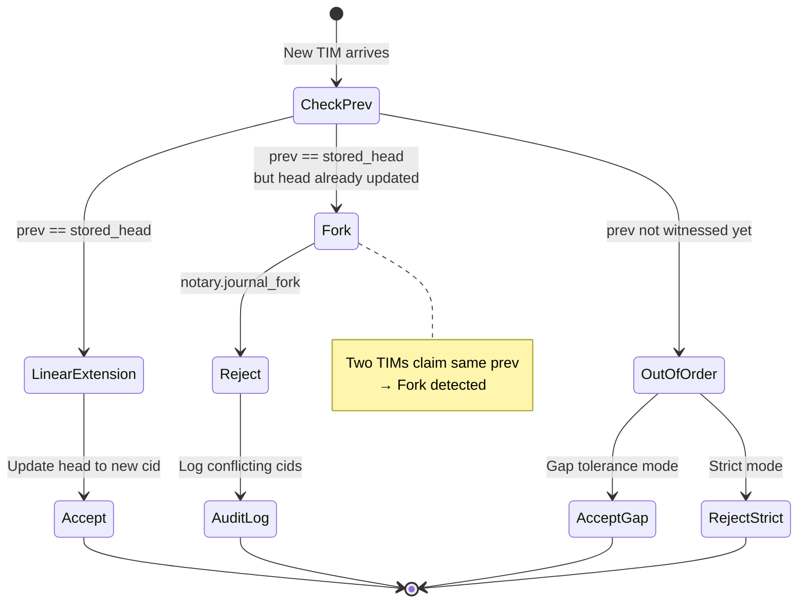

---

spec_id: ARKY-NOTARY-v1
title: Arky — Notary
version: v1
status: implementing
effective: 2025-10-15
doc_type: specification
normative_default: true  # all sections normative unless labeled Informative
depends_on:
  - ARKY-TIM-v1
  - ARKY-TIM-Canonicalization-v1
  - ARKY-ERRORS-v1
  - ARKY-REGISTRIES-v1
  - ARKY-POLICY-PACKS-v1
summary: >
  Defines the Notary role that witnesses TIM receipts and anchors them to public logs/chains,
  with deterministic ordering (including DTN) and multi-anchor proofs. Adds precise data
  models, lexicographic Merkle batching, explicit finality/reorg rules, and CI-friendly
  interface contracts without removing the original requirements.
links:
  core: https://arky.foundation/specs/core/ARKY-TIM-v1
  canonicalization: https://arky.foundation/specs/core/ARKY-TIM-Canonicalization-v1
  registries: https://arky.foundation/specs/infrastructure/ARKY-REGISTRIES-v1
  policy_packs: https://arky.foundation/specs/core/ARKY-POLICY-PACKS-v1
  vectors: https://arky.foundation/vectors/
  rfcs: https://arky.foundation/rfcs/
governance:
  owner: Arky Foundation Technical Council
  process: RFC with public review and test vectors
authors:
  - Arky Foundation Spec WG
license:
  text: CC-BY-4.0
  code: Apache-2.0
permalink: /specs/core/ARKY-NOTARY-v1
last_updated: 2025-10-15

---

# Arky — Notary (v1)

spec ID: ARKY-NOTARY-v1
Effective: 2025-10-15

**All sections are normative unless labeled *Informative*.** This specification defines the Notary role that witnesses TIM receipts and anchors them to public logs/chains with deterministic ordering for intermittent/DTN environments.

---

## 1. Scope

* Applies to **TIM Core (v1)** receipts.
* Defines witnessing, multi‑anchor behavior, ordering/merge rules, proofs, and conformance for Notary implementations.
* Out of scope: settlement/execution (Settlers), domain policies (Profiles), UI.


> Example: see `examples/flows/notary-witness.md` for end-to-end submit → witness → batch → anchor → proof example.

---

## 2. Terminology

* **Receipt:** TIM Core (v1) object.
* **Canonical bytes:** JCS‑canonicalized unsigned TIM body (TIM Canonicalization v1).
* **Witness signature:** JWS Ed25519 over canonical bytes; appended to `time.witnesses[]`.
* **Anchor target:** Public append‑only system (e.g., EVM chain via CAIP‑2, Solana, transparency log).
* **TargetURN (alias of Anchor target id):** registered identifier for a target, e.g., `caip2:eip155:1`, `solana:mainnet`, `btc:mainnet`, `log:arky:transparency@v1`. Targets **MUST** exist in the Rails & Anchor Targets Registry.
* **Anchor record:** Immutable record that commits to one or more `cid`s (e.g., tx with Merkle root).
* **Batch:** Set of `cid`s combined under a Merkle root for efficient anchoring.
* **Ordering hint:** Optional `time.ordering` fields (e.g., Lamport counter).
* **Journal:** Sequence of related receipts linked by `prev`.

---

## 3. Data Model

Shapes below are normative for interoperable APIs and CI vectors.

| Object | Required Fields | Optional Fields | Purpose |
|--------|-----------------|-----------------|---------|
| **WitnessReceipt** | cid, sig (JWS over TIM canonical_bytes), notary_id, ts (RFC3339), alg | — | Immediate witness response; sig co-signs same bytes as TIM issuer |
| **AnchorRequest** | cids[] (≥1), targets[] (TargetURNs) | policy{finality_depth}, idempotency_key | Batch anchor request |
| **AnchorRecord** | batch_id, target (TargetURN), root (Merkle), alg, status, finality_depth | locator, anchored_at, finalized_at | Internal persistence for anchor lifecycle |
| **InclusionProof** | target, locator, root, leaf (cid), path[] (sibling hashes), alg | — | Merkle proof for cid inclusion |
| **OrderReceipt** | cid, observed_at (RFC3339) | lamport | Ordering metadata for witnessed TIM |

**Witness signature:** `sig` **MUST** be JWS (compact) over same canonical bytes as TIM issuer (not a different payload). Notary keys **MUST** be resolvable from `notary_id`.

**Persistence:** Notaries **MUST** retain AnchorRecords and proofs per Policy Pack retention period.

---

## 4. Functional Requirements

### 4.1 Ingest

* The Notary **MUST** accept either (a) full receipts or (b) `cid, canonical_bytes` for verification.
* The Notary **MUST** verify `cid` and the issuer's `sig` before witnessing.
* The Notary **MUST** reject receipts that violate TIM Core invariants.

### 4.2 Witnessing

* Upon acceptance, the Notary **MUST** produce a **witness signature** over the canonical bytes and append it to `time.witnesses[]`.
* The Notary's public key **MUST** be resolvable (published via DID/X.509 or equivalent).
* Implementations **MUST** support Ed25519; additional algorithms **MAY** be enabled via Profile.

### 4.3 Batching & Anchoring (deterministic)

* The Notary **MUST** support **batch anchoring**, computing a Merkle root over included `cid`s.
* **Stable order:** Merkle trees **MUST** be built over `cid`s sorted **lexicographically (bytewise)** to ensure identical roots across implementations.
* An **anchor record** **MUST** commit to the Merkle root and identify the **anchor target**.
* The Notary **MUST** retain per‑`cid` **inclusion proofs** (Merkle branch + anchor record locator).

### 4.4 Multi‑anchor, Finality & Reorgs

* The Notary **MUST** support anchoring the same batch/root to **≥1** configured targets.
* For blockchains, a target **MUST** be identified by **CAIP‑2** (chain ID).

**Finality depth calculation:**
For each target, finality depth is determined by:
```
depth = max(
  registry_default,         // from ARKY-REGISTRIES-v1 target definition
  policy_pack_minimum,      // from ARKY-POLICY-PACKS-v1
  request_override          // from AnchorRequest.policy.finality_depth (optional)
)
```

**Override semantics:**
- Request overrides **MAY only increase** depth (never decrease).
- If `request_override < policy_pack_minimum`, the Notary **MUST** reject with `notary.policy_violation`.
- Policy Pack depth acts as a **floor**, not a ceiling.

**Reorg handling:**
- **Before finality:** If a reorg occurs at depth < finality_depth, the Notary **MUST**:
  1. Set `status = "reorged"`
  2. Re-anchor to the new canonical chain
  3. Update `locator` and `anchored_at`
  4. Retain old locator in audit log
- **After finality:** If a reorg occurs at depth ≥ finality_depth (catastrophic):
  1. Set `status = "finality_violated"`
  2. Emit critical alert (out-of-band notification)
  3. Do **NOT** automatically re-anchor
  4. Manual intervention required per Policy Pack remediation rules

### 4.5 Ordering (Single Notary)

**Scope:** This section defines ordering for a **single Notary instance only**. Multi-Notary coordination and DTN merge rules are **out of scope** for v1.

* The Notary **MUST** provide a **deterministic total order** for all witnessed receipts using the tuple:
  1. `time.ordering.lamport` ASC (default 0 if absent)
  2. `observed_at` ASC (Notary observe timestamp)
  3. `cid` ASC (bytewise)

* `time.ts` is used for **clock skew detection** (see below) and **MUST NOT** affect ordering.

**Clock skew handling:**
* If `|time.ts - observed_at|` exceeds configured `max_clock_skew` (e.g., 5 minutes), the Notary **SHOULD** quarantine the receipt.
* Quarantined receipts **MAY** be released if:
  - A configured witness quorum (e.g., 2 of 3) also witnesses the same `cid`, OR
  - Policy explicitly allows high skew (e.g., for space missions)
* Quarantine timeout **MUST** be configured; expired receipts **SHOULD** be rejected with `notary.skew_quarantine`.

**Journal fork detection:** See §4.5.1.

**DTN/Multi-Notary ordering:** Future work. Implementers requiring distributed merge should consult CRDT literature (vector clocks, causal graphs) and propose an RFC.

### 4.5.1 Journal Fork Detection

For TIMs with `prev` (causal chains per ARKY-TIM-v1 §7), track `journal_head` per `identity.id`:



**States:**
- **Linear extension:** `prev` matches stored head → accept, update head
- **Fork:** `prev` matches head but new head already exists → reject with `notary.journal_fork`
- **Out-of-order:** `prev` not yet witnessed → accept (gap tolerance) or reject (strict mode)

**Policy:** Strict mode (default) rejects forks immediately; permissive mode allows if Policy Pack permits.

**Fork audit:** Log conflicting cids, emit error, do not witness, retain metadata. Resolution by identity owner only (merge TIM or abandon branch).

### 4.6 Retention & Availability

* The Notary **MUST** persist: `(cid, witness sig, batch id, anchor proofs, ordering position)` for at least the configured retention period.
* If a receipt is removed for policy/legal reasons, tombstone metadata **MUST** be retained for audit with the reason code.

### 4.7 Policy Pack Enforcement

**Policy Packs are optional constraints** specified via `policy_pack_id` in TIM metadata, AnchorRequest, or deployment configuration.

**If NO Policy Pack is specified:**
- Notary uses default behavior: single witness, default finality depths from ARKY-REGISTRIES-v1, no retention minimums

**If a Policy Pack IS specified, Notary MUST enforce constraints from [ARKY-POLICY-PACKS-v1 §6](ARKY-POLICY-PACKS-v1.md):**

| Constraint | Source | Enforced By Notary |
|------------|--------|-------------------|
| `witness_policy.min_witnesses` | §6.1 | §4.2 — Reject if witness quorum not met |
| `witness_policy.classes` | §6.1 | §4.2 — Require witnesses from specified classes (geographic, operator) |
| `finality_policy.chains` | §6.2 | §4.4 — Apply finality depth minimums per chain |
| `privacy.retention_days` | §6.3 | §4.6 — Minimum retention before tombstoning |
| `anchoring.targets` | §6.2 | §4.3 — Restrict allowed anchor targets |

**Independence:** Kernel and Settler enforce their own Policy Pack constraints separately. Notary only validates witnessing/anchoring constraints.

---

## 5. Anchor Object (API Response)

An **AnchorObject** is the external API representation of an anchor, returned by Status/Proof endpoints. It combines data from `AnchorRecord` (§3.3) plus inclusion proofs.

```typescript
AnchorObject :=
  batch_id: string,                       // from AnchorRecord
  target: string,                         // TargetURN (e.g., caip2:eip155:1)
  locator: string,                        // tx hash, log index, or entry ID
  root: string,                           // Merkle root (multibase-multihash)
  alg: string,                           // tree hash profile (e.g., "merkle-sha256-v1")
  status: "pending"|"final"|"reorged",   // from AnchorRecord
  finality_depth: number,                 // required confirmation depth
  anchored_at: string,                    // RFC3339 timestamp
  finalized_at?: string,                  // RFC3339 when reached finality
  proof?: InclusionProof                  // included if querying specific cid

```

**Relationship to AnchorRecord:**
- `AnchorRecord` (§3.3) = internal persistence model
- `AnchorObject` (§5) = API response format
- Implementations **MUST** populate `AnchorObject` from `AnchorRecord` + proofs

**Requirements:**
* `root` **MUST** commit to all included `cid`s via Merkle tree (§5.1).
* `target` **MUST** be a valid TargetURN from ARKY-REGISTRIES-v1.
* `locator` **MUST** allow retrieval/verification on the target.
* If `proof` is present, it **MUST** be verifiable per §5.2.

### 5.1 Merkle Tree Algorithm

Notaries **MUST** use the following deterministic Merkle tree construction:

**Profile:** `merkle-sha256-v1`

**Leaf construction:**
```
leaf = cid  // cid is already a multibase-multihash; use as-is
```

**Tree building:**
1. Sort all `cid`s **lexicographically (bytewise)** after decoding from multibase.
2. If count is odd, duplicate the last cid to make it even.
3. Build binary tree bottom-up:
   ```
   internal_node = SHA-256(min(left, right) || max(left, right))
   ```
   Where `min/max` are bytewise comparisons to ensure canonical ordering.
4. Encode final root as `multibase(multihash(sha2-256, root_bytes))`.

**Example (3 cids):**
```
cids: [A, B, C]
sorted: [A, B, C]
padded: [A, B, C, C]  // duplicate last
level1: [H(A,B), H(C,C)]
root: H(H(A,B), H(C,C))
```

**Determinism guarantees:**
- All implementations **MUST** produce identical `root` for the same `cid` set.
- Lexicographic sort ensures repeatability across languages.
- Bytewise min/max eliminates ambiguity in sibling ordering.

**Alternative profiles:**
Implementations **MAY** support additional profiles (e.g., `merkle-sha3-256-v1`, `merkle-blake3-v1`) if registered in ARKY-REGISTRIES-v1.

### 5.2 Proof Verification Algorithm

Given an `InclusionProof` (§3.4), verifiers **MUST** execute:

**Input:**
- `proof.leaf` (cid to verify)
- `proof.path` (array of sibling hashes)
- `proof.root` (claimed Merkle root)
- `proof.alg` (must be `merkle-sha256-v1`)

**Algorithm:**
```
1. current = proof.leaf  // start with cid
2. for each sibling in proof.path:
     current = SHA-256(min(current, sibling) || max(current, sibling))
3. assert current == proof.root
```

**Failure conditions:**
- If assertion fails → `notary.proof_invalid`
- If `alg` unknown → `notary.unsupported_alg`
- If `path` is malformed → `common.invalid_argument`

---

## 6. Cadence & Finality

* **Batching:** The Notary **MUST** support limits: max batch size (count/bytes) and max dwell time before anchoring.
* **Cadence:** The Notary **SHOULD** anchor at regular intervals under load; under low volume it **MAY** anchor immediately.
* **Finality:** For each blockchain target, the Notary **MUST** maintain chain‑specific finality depths; status **MUST** transition `pending → final` only after the depth is met.
* **Reorgs:** If an anchor reorgs before finality, the Notary **MUST** re‑anchor and update proofs; if after finality, policy **MUST** define remediation (e.g., additional anchors).

---

## 7. Trust & Witness Policy

* **Key management:** Notary keys **MUST** support rotation; previous keys **MUST** remain verifiable for historical receipts.
* **Quorum classes:** Deployments **MAY** define classes (e.g., regional, organizational) and **MUST** publish the active policy.
* **Independence:** Multiple witnesses on the same receipt **SHOULD** be operationally independent.
* **Audit:** The Notary **MUST** expose an audit log of key events (key rotations, policy updates, outages).

---

## 8. Interfaces

Implementations **MUST** expose minimal HTTP or gRPC endpoints. JSON is the default media type.

* **Submit** `POST /notary/submit`
  Input: TIM receipt **or** ` cid, canonical_bytes `.
  Output: ` cid, witness_sig, batch_id `.
  Errors: See §8.1.

* **Status** `GET /notary/status/:cid`
  Output: ` cid, anchors: [AnchorObject...], order_index `.
  Errors: See §8.1.

* **Proof** `GET /notary/proof/:cid`
  Output: ` cid, anchor: AnchorObject `.
  Errors: See §8.1.

* **Policy** `GET /notary/policy`
  Output: active witness & anchoring policy (read‑only).
  Errors: See §8.1.

* **Keys** `GET /.well-known/arky/jwks.json`
  Output: Notary public keys and metadata.
  Errors: See §8.1.

**All error responses MUST use ARKY-ERRORS-v1 Error Envelope.**

AuthN/AuthZ is deployment‑specific and **out of scope**.

### 8.1 Error Codes

Notary operations **MUST** return errors using ARKY-ERRORS-v1 with the following codes:

**Submission errors:**
- `common.invalid_argument` — Malformed request body
- `tim.cid_mismatch` — Provided cid doesn't match canonical_bytes
- `tim.invalid_signature` — TIM issuer signature verification failed
- `tim.missing_required` — Required TIM fields absent
- `notary.duplicate` — cid already witnessed (idempotent; return existing receipt)
- `notary.policy_violation` — TIM violates Policy Pack constraints
- `notary.rate_limited` — Client exceeded rate limit
- `notary.quota_exceeded` — Batch or storage quota reached
- `common.unavailable` — Notary temporarily unavailable

**Status/Proof errors:**
- `common.not_found` — cid not witnessed by this Notary
- `notary.anchor_pending` — Anchor not yet finalized (transient)
- `notary.finality_unmet` — Finality depth not reached (transient)
- `common.deadline_exceeded` — Request timeout

**Anchoring errors (internal):**
- `notary.anchor_reorg` — Anchor reorganized before finality
- `notary.unsupported_target` — Target not configured
- `notary.finality_violated` — Reorg occurred after finality (critical)

**Ordering errors:**
- `notary.ordering_violation` — Lamport counter regression detected
- `notary.journal_fork` — Multiple TIMs claim same prev (fork detected)
- `notary.skew_quarantine` — time.ts outside acceptable clock skew

**Proof errors:**
- `notary.proof_invalid` — Inclusion proof verification failed
- `notary.unsupported_alg` — Unknown Merkle tree algorithm

**Retry hints:**
- Transient errors (`anchor_pending`, `finality_unmet`, `rate_limited`) **SHOULD** include `retry.policy="after"` or `"exponential"`.
- Permanent errors (`duplicate`, `policy_violation`, `journal_fork`) **MUST** set `retry.policy="never"`.

---

## 9. Security & Privacy

* Only `cid`/hash material **MUST** be anchored publicly; never PHI/PII.
* DoS: bound submit size/rate; deduplicate by `cid`.
* Time: use secure time sources; detect skew (see §4.5).
* Reorgs: handle per §4.4/§6; re‑anchor before finality, remediate after.
* Transparency: AnchorObject data **SHOULD** be queryable for third‑party verification.
* Key hygiene: support rotation; publish revocation where applicable.

---

## 10. Conformance

Levels for Notary implementations:

* **N1 — Witness:** verify receipts, produce witness signatures, expose Keys/Policy endpoints.
* **N2 — Anchor:** N1 + batch anchoring to ≥1 target with proofs and finality tracking.
* **N3 — Multi‑anchor & DTN:** N2 + multi‑anchor, deterministic ordering, journal fork detection, reorg remediation.

A Notary **MAY** claim `ARKY-NOTARY-v1 N1/N2/N3` only if it passes the Foundation's vectors in **ARKY‑VECTORS‑v1**.

---

## 11. Constraints Matrix (Informative)

| Area                     | MUST                                                                                                                     | SHOULD                                    | MAY                            |
| ------------------------ | ------------------------------------------------------------------------------------------------------------------------ | ----------------------------------------- | ------------------------------ |
| Ingest                   | accept full receipt or `cid, canonical_bytes`; verify `cid` & issuer `sig`; reject TIM‑invalid receipts                | —                                         | —                              |
| Witnessing               | produce witness signature over canonical bytes; append to `time.witnesses[]`; support **Ed25519**; Notary key resolvable | —                                         | additional algs via Profile   |
| Batching & Anchoring     | batch anchoring; **lexicographic** Merkle order; anchor record identifies target; retain per‑`cid` inclusion proofs      | deterministic split on overflow           | —                              |
| Multi‑anchor             | support ≥1 targets; blockchain targets by **CAIP‑2**; enforce finality depth; re‑anchor on reorg < depth                 | —                                         | —                              |
| Ordering & Merge         | tuple: lamport → observed_at → cid; reject journal forks unless policy allows                                            | quarantine skewed `ts` until corroborated | —                              |
| Cadence & Finality       | enforce max batch size/bytes & dwell; mark `pending→final` only after depth met                                          | anchor at regular intervals               | immediate anchor at low volume |
| Retention & Availability | persist `(cid, witness sig, batch id, proofs, order index)`; tombstones with reason                                      | —                                         | —                              |
| Trust & Witness Policy   | key rotation; publish active policy; audit log of key events                                                             | witnesses operationally independent       | quorum classes configurable    |
| Error Handling            | use namespaced codes (notary.*); include retry per ARKY-ERRORS-v1                                                     | structured error messages                 | —                              |
| Interfaces               | expose **Submit/Status/Proof/Policy/Keys** with specified IO & errors                                                    | —                                         | —                              |
| Security & Privacy       | anchor only hashes; DoS bounds; secure time & skew detection; reorg handling; key hygiene                                | transparency: queryable AnchorObject data | —                              |

---

## 12. Versioning & Governance

* **Spec ID:** `ARKY-NOTARY-v1`.
* Changes follow RFC with public vectors. Backwards compatibility is **RECOMMENDED**; migrations must be documented.
* Algorithm profiles (hash trees, signature envelopes) are maintained in **Registries**.

---

**End of Notary (v1).**
