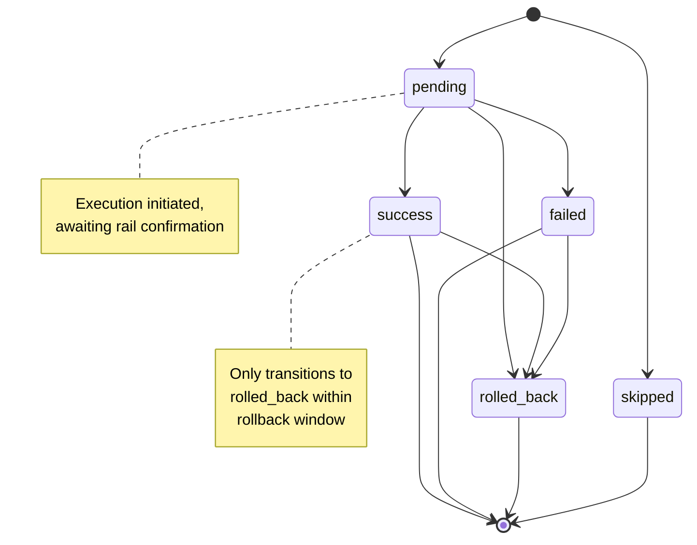

---

spec_id: ARKY-SETTLERS-v1
title: Arky — Settlers
version: v1
status: review
effective: 2025-10-15
doc_type: specification
normative_default: true  # all sections normative unless labeled Informative
depends_on:
  - ARKY-TIM-Canonicalization-v1
  - ARKY-TIM-v1
  - ARKY-NOTARY-v1
  - ARKY-ERRORS-v1
  - ARKY-REGISTRIES-v1
summary: >
  Defines settlers — minimal adapters that execute Consequences on external rails
  (blockchains, bank/payment networks, hardware controllers) with idempotency,
  rollback windows, and auditable execution receipts.
links:
  core: https://arky.foundation/specs/core/ARKY-TIM-v1
  notary: https://arky.foundation/specs/core/ARKY-NOTARY-v1
  vectors: https://arky.foundation/vectors/
  rfcs: https://arky.foundation/rfcs/
  registries: https://arky.foundation/registries/settlers-verbs-v1.json
governance:
  owner: Arky Foundation Technical Council
  process: RFC with public review and test vectors
authors:
  - Arky Foundation Dev WG
license:
  text: CC-BY-4.0
  code: Apache-2.0
permalink: /specs/core/ARKY-SETTLERS-v1
last_updated: 2025-10-15

---

# Arky — Settlers (v1)

Spec ID: ARKY-SETTLERS-v1
Effective: 2025-10-15

**All sections are normative unless labeled *Informative*.** Settlers are minimal executors that turn validated commitments into actions on specific rails.

## Executive Summary (Informative)

**What Settlers Do:**
- Execute verbs (pay, refund, control, etc.) on external rails (blockchains, banks, hardware)
- Emit signed Execution Receipts (XR) for every attempt
- Handle idempotency, rollbacks, and failure modes
- Support 7 core verbs: `pay`, `refund`, `slash`, `revoke`, `upgrade`, `signal`, `control`

**Key Concepts:**
- **Verb** → Action to perform (e.g., `arky:verb:pay@v1`)
- **Rail** → Where to execute (e.g., `ach:us`, `cai2:eip155:1`, `hw:robot-arm`)
- **XR (Execution Receipt)** → Signed proof of execution with status: `pending`/`success`/`failed`/`rolled_back`

**Conformance Levels:**
- **1** — Basic execution + XR emission
- **2** — Idempotency + rollback support
- **3** — Multi-rail + DTN/offline resilience

---

## 1. Scope

* Applies to **commitments** that reference TIM receipts (evidence) and define **Consequences** to execute.
* Defines: consequence grammar, execution lifecycle, execution receipts, idempotency, rollback, failure modes, interfaces, and conformance.
* Out of scope: business policy, UI, and off-spec domain logic.

---

> ** Complete Example:** See [Settler Execution Flow](../../examples/flows/settler-execution.md) for an ACH payment execution example.

---

## 2. Terminology

* **Commitment:** A higher-layer object (e.g., Kernel) that references one or more TIM receipts and declares **Consequences**.
* **Rail:** External system where actions occur (EVM/Solana chain, bank rails like ACH/SEPA, mobile money, custody, hardware controllers).
* **Settler:** Implementation that executes consequences on one rail.
* **Execution Receipt (XR):** Signed evidence of attempted execution emitted by a settler.
* **Rollback window:** Time period during which executions may be reversed or compensated.

---

## 2.1 ExecutionRequest (ER)

```json
ExecutionRequest := {
  "request_id": "string",                 // required (client-generated)
  "commitment_cid": "string",             // required (CID of the commitment)
  "verbs": [                              // required (>=1)
    {
      "verb": "string",                   // required (URN, e.g., arky:verb:pay)
      "rail": "string",                   // required (TargetURN or rail id)
      "args": {},                         // required (validates against verb schema)
      "max_fee": { "unit": "string", "value": 0 },   // optional
      "deadline": "RFC3339"                           // optional; MUST NOT execute after
    }
  ],
  "anchors_required": false,              // optional; default false
  "policy": { "id": "arky:policy:global@v1" }, // optional
  "idempotency_key": "string",            // optional; see §6 if absent
  "notary": { "target": "TargetURN" },    // optional preferred anchor target
  "context": { "actor": "string" }         // optional actor override/affirmation
}
```

**Constraints**

* `verbs[i].verb` **MUST** exist in Verbs Registry; `args` **MUST** pass its JSON schema.
* `rail` **MUST** exist in Rails Registry and be permitted for the verb.
* If `deadline` is past on ingest → **reject** with `deadline_exceeded`.

---

## 3. Consequence Grammar

A Settler **MUST** implement a minimal, portable set of verbs (namespace `consequence.*`).

**3.1 Verbs**

* `pay` — transfer or escrow release on the rail.
* `refund` — return funds.
* `slash` — penalize collateral.
* `revoke` — revoke a capability/license reference.
* `upgrade` — elevate scoped permissions.
* `signal` — attest or emit a signal/event on the rail.
* `control` — send a bounded command to a hardware controller.

**3.2 Verb Argument Schemas**

All verbs **MUST** validate arguments against these schemas:

| Verb | Required Args | Optional Args | Key Rules |
|---|---|---|---|
| **pay@v1** | `to`, `amount{value,unit}` | `from`, `memo` (≤256 chars), `escrow_release{escrow_id,conditions_met[]}` | amount.value > 0, finite |
| **refund@v1** | `to`, `amount{value,unit}` | `original_tx`, `reason` (≤256 chars), `partial` (bool) | amount.value > 0 |
| **slash@v1** | `from`, `to`, `reason`, amount XOR percent | `collateral_id` | Exactly one of `amount` or `percent` (0-100) |
| **revoke@v1** | `capability_id` | `scope`, `effective_at` (RFC3339), `reason` (≤256 chars) | — |
| **upgrade@v1** | `capability_id`, `level` | `scope`, `expires_at` (RFC3339), `conditions[]` | level = string | number |
| **signal@v1** | `topic`, `payload_hash` | `payload`, `timestamp` (RFC3339), `metadata` | hash = multibase-multihash |
| **control@v1** | `device_id`, `command` | `params`, `safety_bounds{max_duration_ms,max_force,max_temp,emergency_stop_enabled}`, `confirmation_required` (bool) | For physical systems, safety_bounds recommended |

**General rules:**
- All `amount.value` fields **MUST** be positive, finite
- Unknown fields **SHOULD** be rejected
- Settlers **MUST** validate before pre-checks

**3.3 Extensibility & Namespaces**

* **Core verbs (stable):** `pay`, `refund`, `slash`, `revoke`, `upgrade`, `signal`, `control`.
* **Namespaced verbs:** Extensions **MUST** use `ns.verb` (e.g., `custody.freeze`, `telemetry.push`). The namespace `ns` **MUST** be registered in the **Settlers Verbs Registry** (see links) or use the experimental prefix `x-<org>.verb` during incubation.
* **Registration (RFC):** New verbs **MUST** be proposed via an RFC including: formal semantics; input schema; idempotency rules; safety/rollback behavior; failure-class mapping; rail applicability; and **conformance vectors**. On approval, the registry is updated.
* **Versioning:** Breaking semantic changes **MUST** bump the verb version suffix (e.g., `ns.verb@v2`). Minor clarifications that do not change observable effects **MAY** retain the version.
* **Unknown verbs:** Settlers **MUST** reject unknown verbs by default. Deployments **MAY** allow specific `x-<org>.verb` entries via an explicit allowlist.
* **Deprecation:** Deprecated verbs **MUST** specify a sunset date and a recommended replacement; settlers **SHOULD** continue to accept them during the overlap period.

---

## 4. Execution Lifecycle

* **Validate:** Verify commitment authenticity/authorization and referenced TIM receipts (≥ T2; T3 if required by policy).
* **Pre-checks:** Confirm balance/allowance, route availability, and policy gates (KYC/KYB, export control).
* **Execute:** Perform verb(s) atomically per rail capability. If atomicity is impossible, follow partial execution semantics (§4.1).
* **Emit XR:** Produce an **Execution Receipt** per verb (or batch) and sign it.
* **Finalize/Rollback:** Respect the **rollback window**. On cancellation or failure, attempt compensating actions and record both in XRs.

---

### 4.1 Partial Execution Semantics

When an `ExecutionRequest` contains multiple verbs (`verbs[]`), settlers **MUST** follow these rules:

**Default behavior (STOP_ON_FAILURE):**
1. Execute verbs **in array order** (index 0, 1, 2...)
2. If verb[i] succeeds → emit XR with `status=success`, continue to verb[i+1]
3. If verb[i] fails → emit XR with `status=failed`, **STOP** execution
4. Verbs after failure **MUST** have XR with `status=skipped`

**Atomicity:**
- **Per-verb atomicity**: Each verb execution is atomic on its rail
- **Cross-verb atomicity**: NOT guaranteed by default (out of scope for v1)
- **Cross-rail atomicity**: NOT supported (e.g., cannot rollback EVM tx if ACH fails)

**Failure cascade algorithm:**
```typescript
function executeVerbs(request: ExecutionRequest): XR[] {
  const results: XR[] = [];

  for (let i = 0; i < request.verbs.length; i++) {
    const verb = request.verbs[i];

    // Execute verb
    const xr = await executeVerb(verb, request);
    results.push(xr);

    // Check result
    if (xr.status === "failed") {
      // Stop execution, skip remaining verbs
      for (let j = i + 1; j < request.verbs.length; j++) {
        results.push({
          ...buildXREnvelope(request.verbs[j], request),
          status: "skipped",
          error: {
            code: "settler.prior_verb_failed",
            message: `Verb ${i} failed, skipping verb ${j}`
          }
        });
      }
      break;
    }
  }

  return results;
}
```

**Partial success handling:**
- If verbs [0,1] succeed but verb[2] fails → client receives:
  - XR[0]: `status=success`
  - XR[1]: `status=success`
  - XR[2]: `status=failed`
  - XR[3...n]: `status=skipped`
- Client **MUST** handle compensation for successful verbs if needed
- Settlers **SHOULD** support rollback window for reversible rails (see §7.1)

**Best-effort mode (optional extension):**
- Settlers **MAY** support `"execution_mode": "best_effort"` in ExecutionRequest
- In best-effort mode: continue executing verbs after failures
- All failed verbs have `status=failed`, successful verbs have `status=success`
- Final result indicates partial success/failure
- This mode **MUST** be explicitly documented per settler

**Transaction boundaries:**
- Single-rail batching: settler **MAY** batch multiple verbs to same rail in one transaction (rail-dependent)
- If batched, XRs **SHOULD** share same `locator` with different `verb` values
- Batch atomicity follows rail semantics (e.g., EVM transaction executes all or reverts all)

---

### 4.2 Pre-checks Algorithm

Settlers **MUST** run these checks before execution (in order):

```mermaid
flowchart TD
    Start([Receive ExecutionRequest]) --> V1Deadline<br/>OK?
    V1 -->|No| Fail1[XR: skipped<br/>settler.deadline_exceeded]
    V1 -->|Yes| V2Verb in<br/>registry?
    V2 -->|No| Fail2[XR: skipped<br/>settler.unknown_verb]
    V2 -->|Yes| V3Args valid<br/>per schema?
    V3 -->|No| Fail3[XR: skipped<br/>settler.invalid_args]
    V3 -->|Yes| C1Commitment<br/>signature valid?
    C1 -->|No| Fail4[XR: skipped<br/>settler.auth_failed]
    C1 -->|Yes| C2Actor<br/>authorized?
    C2 -->|No| Fail5[XR: skipped<br/>settler.policy_denied]
    C2 -->|Yes| T1TIMs<br/>valid?
    T1 -->|No| Fail6[XR: skipped<br/>tim.invalid_signature]
    T1 -->|Yes| T2TIMs<br/>fresh?
    T2 -->|No| Fail7[XR: skipped<br/>tim.expired]
    T2 -->|Yes| R1Balance<br/>sufficient?
    R1 -->|No| Fail8[XR: skipped<br/>settler.insufficient_funds]
    R1 -->|Yes| R2Rail<br/>healthy?
    R2 -->|No| Fail9[XR: skipped<br/>settler.rail_unavailable]
    R2 -->|Yes| R3Rate limit<br/>OK?
    R3 -->|No| Fail10[XR: skipped<br/>settler.rate_limited]
    R3 -->|Yes| P1KYC/sanctions<br/>pass?
    P1 -->|No| Fail11[XR: skipped<br/>settler.policy_denied]
    P1 -->|Yes| Execute[Execute verb<br/>on rail]

    Fail1 --> End([Return XR])
    Fail2 --> End
    Fail3 --> End
    Fail4 --> End
    Fail5 --> End
    Fail6 --> End
    Fail7 --> End
    Fail8 --> End
    Fail9 --> End
    Fail10 --> End
    Fail11 --> End
    Execute --> End
```

**Pre-check steps:**

1. **Request validation:** Deadline, verb exists in registry, args schema
2. **Commitment validation:** Signature, actor authorization
3. **TIM validation:** Verify TIMs (T2+), check freshness
4. **Rail checks:** Balance, health, rate limits
5. **Policy gates:** KYC/sanctions/export control

**Result:** All pass → execute; any fail → XR with `status=skipped` + error code. Pre-checks **SHOULD** complete <5s

---

### 4.3 Anchors & finality

* When `anchors_required=true` (or verb policy demands), settler **MUST** obtain a Notary proof **post-execution** (default) or **pre-execution** if the verb specifies.
* Anchors **MUST** target registered **TargetURNs**. Finality **MUST** follow:
  `max(Registry default, Policy Pack, per-request override)`.
* On reorg < finality: settler **MUST** refresh anchors; on reorg ≥ finality: mark `error.code=finality_unmet` and follow policy.

### 4.4 Policy Pack Enforcement

**Policy Packs are optional constraints** specified via `policy_pack_id` in ExecutionRequest, commitment metadata, or deployment configuration.

**If NO Policy Pack is specified:**
- Settler uses default behavior: no amount caps, no two-person control, default rollback windows per rail

**If a Policy Pack IS specified, settler MUST enforce constraints from [ARKY-POLICY-PACKS-v1 §6](ARKY-POLICY-PACKS-v1.md):**

| Constraint | Source | Enforced By Settler |
|---|---|---|
| `limits.amount_caps` | §6.4 | §4.2 — Reject if verb amount exceeds cap for actor/verb/rail |
| `limits.two_person_control` | §6.4 | §4.2 — Require approver signature if threshold met |
| `rollback.window_hours` | §6.5 | §7.1 — Minimum rollback window before finalization |
| `rollback.allowed_verbs` | §6.5 | §7.1 — Restrict which verbs support rollback |
| `rails.allowed` | §6.2 | §4.2 — Reject if rail not in allowed list |
| `compliance.kyc_required` | §6.6 | §4.2 — Block execution if KYC/sanctions check fails |

**Independence:** Kernel and Notary enforce their own Policy Pack constraints separately. Settler only validates execution/rail constraints.

**Example enforcement:**
```typescript
// Pre-check: amount cap
if (policyPack && verb.args.amount > policyPack.limits.amount_caps[verb.verb]) {
  return { status: "skipped", error: { code: "settler.policy_amount_exceeded" } };
}

// Pre-check: two-person control
if (policyPack && verb.args.amount >= policyPack.limits.two_person_control.threshold) {
  if (!request.approver_signature) {
    return { status: "skipped", error: { code: "settler.approval_required" } };
  }
}
```

---

## 5. Execution Receipt (XR)

```json
XR := {
  "request_id": "string",                 // required (echo)
  "commitment_cid": "string",             // required
  "verb": "string",                       // required
  "rail": "string",                       // required
  "args_hash": "multibase-multihash",     // required (JCS-canonical args)
  "status": "success|pending|failed|rolled_back|skipped",  // required
  "locator": "string",                    // rail txid/sig/entry (required if produced)
  "cost": { "unit": "string", "value": 0 },               // optional
  "anchors": [                            // optional; Notary results
    { "target": "TargetURN", "locator": "string", "status": "pending|final" }
  ],
  "error": { "code": "string", "message": "string" },     // optional on failure
  "ts": "RFC3339",                         // required (completion time)
  "cid": "string",                         // required (content id of canonical XR body)
  "sig": "string"                          // required (settler JWS Ed25519 over canonical body)
}
```

**Rules**

* `args_hash` = multibase(mh(SHA( **JCS**(verb.args) ))); **hash alg** MUST follow the rail's Registry profile.
* `status=success` → `locator` **required** when the rail emits one.
* XR **MUST** be JCS-canonicalized and content-addressed like TIM.
* XRs **MUST** be retained for audit ≥ retention policy.
* If execution spans multiple steps, settler **MUST** emit a sequence of XRs linked by `prev`.

---

### 5.1 XR Canonicalization

ExecutionReceipts follow the same canonicalization rules as TIM. See **[ARKY-TIM-Canonicalization-v1](ARKY-TIM-Canonicalization-v1.md)** for complete algorithm.

**Summary:**
- **Canonical body:** XR object with `cid` and `sig` removed (see `prev` if present)
- **Serialize:** JCS (RFC 8785) with lexicographic key sorting
- **Hash:** SHA-256 → multihash (0x12) → multibase base58-btc
- **Sign:** JWS EdDSA over canonical bytes

**XR-specific rules:**
- If `prev` field exists (for multi-step executions), it **MUST** be included in canonical body
- Status updates **MUST** produce new XR with updated `cid`/`sig` and include `prev` pointing to prior XR
- Once signed, XR **MUST NOT** be modified (immutability invariant)

**Example canonical body (before cid/sig):**
```json
{
  "anchors": [{"locator": "batch_001", "status": "pending", "target": "arky:notary/foundation-primary@v1"}],
  "args_hash": "z4EF...",
  "commitment_cid": "zQmKERNEL456...",
  "cost": { "unit": "USD", "value": 2.5 },
  "locator": "ACH20251015T143005-xyz",
  "rail": "arky:rail/ach:us@v1",
  "request_id": "req_2025-10-15_001",
  "status": "pending",
  "ts": "2025-10-15T14:30:05Z",
  "verb": "arky:verb/pay@v1"
}
```
Note: Keys are sorted alphabetically; no `cid` or `sig` present.

---

### 5.2 XR Status State Machine

XR status transitions follow deterministic rules:



**States:**
- `pending` — execution initiated, awaiting rail confirmation
- `success` — execution confirmed by rail
- `failed` — execution rejected or errored
- `rolled_back` — execution reversed within rollback window
- `skipped` — execution not attempted (policy/pre-check failure)

**State machine rules:**
1. **pending → success**: Rail confirms execution
2. **pending → failed**: Rail rejects or timeout occurs
3. **pending → rolled_back**: Cancelled within rollback window before success
4. **success → rolled_back**: Reversed within rollback window (e.g., ACH reversal)
5. **failed → rolled_back**: Compensation executed after partial failure
6. **skipped**: Never transitions (terminal from start)

**Immutable terminals:**
- `success` (after rollback window closes)
- `failed` (if rail doesn't support rollback)
- `skipped`

**Implementation:**
```typescript
function canTransition(from: status, to: status, context: Context): boolean {
  const transitions = {
    pending: ["success", "failed", "rolled_back"],
    success: context.withinRollbackWindow ? ["rolled_back"] : [],
    failed: context.railSupportsRollback ? ["rolled_back"] : [],
    rolled_back: [],
    skipped: []
  };
  return transitions[from]?.includes(to) ?? false;
}
```

**Status update protocol:**
- Each transition **MUST** produce a new XR with updated `status`, `ts`, `cid`, `sig`
- New XR **SHOULD** include `prev` field pointing to prior XR's `cid`
- Settlers **MUST** retain all XR versions for audit trail

---

## 6. Idempotency & Ordering

---

### 6.1 Idempotency Key Derivation

Settlers **MUST** implement deterministic idempotency to ensure safe retries.

**If client provides `idempotency_key`:**
- Settler **MUST** dedupe per tuple `(idempotency_key, verb, rail)`
- Return cached XR if exists
- XR **MAY** be updated (e.g., `anchors.status` progression from `pending` → `final`)
- Client-provided keys **SHOULD** be UUIDv4 or similar high-entropy values

**If `idempotency_key` absent (default):**
Settler **MUST** derive key from request deterministically:

**Algorithm:**
```typescript
function deriveIdempotencyKey(request: ExecutionRequest, verbIndex: number): string {
  const verb = request.verbs[verbIndex];

  // 1. Compute args_hash (already in XR, but recompute for key derivation)
  const argsCanonical = JCS.serialize(verb.args);
  const argsHash = computeMultihash(argsCanonical, railDef.hash_alg);

  // 2. Build input components
  const components = {
    commitment_cid: request.commitment_cid,
    verb: verb.verb,
    rail: verb.rail,
    args_hash: argsHash,
    verb_index: verbIndex  // include index for multi-verb requests
  };

  // 3. Canonical serialization (JCS)
  const componentsCanonical = JCS.serialize(components);

  // 4. Hash with rail-specific algorithm
  const hashAlg = railDef.hash_alg || "sha2-256";  // default sha2-256
  const hash = computeHash(hashAlg, componentsCanonical);

  // 5. Encode as multihash + multibase
  const multihash = encode(SHA_CODE[hashAlg], hash.length, hash);
  const idempotencyKey = multibase.encode("base58btc", multihash);

  return idempotencyKey;
}
```

**Byte-level specification:**
```typescript
// Input format (JCS-serialized):
{
  "args_hash": "z4EF...",
  "commitment_cid": "zQmKERNEL456...",
  "rail": "arky:rail/ach:us@v1",
  "verb": "arky:verb/pay@v1",
  "verb_index": 0
}

// Serialization (JCS, no whitespace):
const canonical = '{"args_hash":"z4EF...","commitment_cid":"zQmKERNEL456...","rail":"arky:rail/ach:us@v1","verb":"arky:verb/pay@v1","verb_index":0}';

// Hash (SHA-256 example):
const bytes = utf8.encode(canonical);
const hash = sha256(bytes);  // 32 bytes

// Multihash (0x12 = SHA-256, 0x20 = 32 bytes):
const multihash = [0x12, 0x20, ...hash];

// Multibase (base58-btc, prefix 'z'):
const idempotencyKey = base58btc.encode(multihash);  // "z4E..."
```

**Hash algorithm selection:**
- Default: `sha2-256` (multihash code `0x12`)
- Rails **MAY** specify alternative in registry (e.g., `blake3` for performance)
- Settlers **MUST** support sha2-256; **MAY** support additional algorithms

**Deduplication semantics:**
```typescript
interface IdempotencyCache {
  key: string;
  xr: XR;
  created_at: string;
  ttl_ms: number;  // cache retention (e.g., 24h)
}

function checkIdempotency(key: string): XR | null {
  const cached = cache.get(key);

  if (!cached) {
    return null;  // Not seen before
  }

  if (Date.now() - Date.parse(cached.created_at) > cached.ttl_ms) {
    cache.delete(key);  // Expired
    return null;
  }

  // Return cached XR (may have updated status/anchors)
  return cache.get(key).xr;
}

function storeIdempotency(key: string, xr: XR, ttl_ms: number = 86400000) {
  cache.set(key, {
    key,
    xr,
    created_at: xr.ts,
    ttl_ms
  });
}
```

**Retry safety guarantees:**
1. Same `idempotency_key` + `verb` + `rail` → same result
2. XR fields may update over time:
   - `status`: `pending` → `success`
   - `anchors[].status`: `pending` → `final`
   - `ts`: May reflect latest query time
3. XR `cid` changes only if canonical body changes (status update)
4. Rail execution **MUST** be idempotent (e.g., ACH dedupe by `idempotency_key`)

**Cache TTL:**
- Default: 24 hours
- Rails with longer settlement: extend TTL (e.g., ACH = 48h)
- Rails with instant finality: shorter TTL (e.g., 1h)
- Registry **SHOULD** specify recommended `idempotency_ttl_ms`

---

### 6.2 Ordering Guarantees

**Verb execution order:**
- Verbs in `ExecutionRequest.verbs[]` **MUST** execute in array index order (0, 1, 2...)
- See §4.1 for partial execution semantics when failures occur

**Single-rail ordering:**
- If multiple verbs target same rail, settler **MAY** batch them into one transaction (rail-dependent)
- Batch ordering follows array order
- Batch atomicity follows rail semantics (e.g., EVM transaction executes all or reverts all)

**Multi-rail ordering:**
- No cross-rail atomicity guarantees in v1
- Each rail executes independently
- Failures on one rail do NOT auto-rollback other rails (client must compensate)

**Natural ordering (rail finality):**
- Use rail's native finality mechanism (block confirmations, settlement times)
- Settlers **MUST** expose ordering via:
  - `XR.ts`: Execution timestamp (RFC3339)
  - `XR.locator`: Rail-specific transaction ID
  - `XR.anchors[]`: Notary anchor references (if anchored)

**Deterministic local ordering:**
- If rail lacks ordering (e.g., off-chain systems), settler **MUST** provide:
  - Monotonic counter (e.g., `xr_sequence_number`)
  - Deterministic timestamps (no clock skew)
  - Total order via single-writer or consensus

**Delivery semantics:**
- **At-least-once**: Retries may occur; idempotency required
- **Exactly-once**: Ideal but not always feasible (rail-dependent)
- Settlers **MUST** document delivery semantics per rail in registry

**Conflict resolution:**
- If two ExecutionRequests have same `idempotency_key`:
  - First wins (cached)
  - Second returns cached XR
  - No conflict error (intentional idempotency)

---

## 7. Rollback & Compensation

### 7.1 Rollback Windows

Rollback windows allow reversing executions within a time bound when rail supports it.

```mermaid
gantt
    title Rollback Window Timeline
    dateFormat X
    axisFormat %M min

    section Window States
    Open (rollback allowed)      :open, 0, 54
    Closing (last 10%, warnings) :closing, 54, 6
    Closed (rollback denied)     :closed, 60, 30

    section Events
    Execution                    :milestone, exec, 0, 0
    Warning alerts start         :milestone, warn, 54, 0
    Window closes                :milestone, close, 60, 0
```



**Window spec:** `duration_ms, start_from: "execution"|"success", rail_override?`

**States:** `open` (0-90% of duration) → `closing` (90-100%) → `closed`

**Eligibility:** Rail supports rollback AND window not closed AND XR status in `["pending","success","failed"]`

**Execution:**
1. Validate eligibility (else `settler.rollback_window_closed`)
2. Call rail-specific rollback (e.g., ACH reversal, smart contract revert)
3. If rail fails with `settler.irreversible` → attempt compensation (§7.2)
4. Emit new XR with `status=rolled_back`, link via `prev` field

**Rail capabilities:**
- **Supports rollback:** ACH (2-60 days), SEPA (8 weeks), card networks (120 days), smart contracts with escrow
- **No rollback:** Bitcoin/Ethereum L1, wire transfers post-settlement, cash

Rail registry **MUST** declare `supports_rollback` and `default_rollback_window_ms`.

### 7.2 Compensation

When rollback impossible (irreversible rail or closed window), execute compensating action:

**Compensation mapping:**
| Original Verb | Compensation | Action |
|---|---|---|
| pay | refund | Return funds to sender |
| slash | pay | Restore slashed amount |
| upgrade | revoke | Revoke elevated permission |
| revoke | upgrade | Restore capability |
| signal | signal | Emit reversal signal |
| control | control | Send opposite command |

**Process:**
1. Determine compensation verb from mapping
2. Build inverse args (refund to original sender, restore prior state, etc.)
3. Execute compensation verb on same rail
4. Update original XR: `status=rolled_back`, `rollback.compensation_xr=<new_cid>`

**Guarantees:**
- **Best-effort:** May fail (insufficient funds, etc.)
- **Idempotent:** Same input → same result
- **Auditable:** Compensation XR references original via `context.compensation_for`
- **Non-recursive:** Compensation failures don't trigger further compensation

**Errors:** See ARKY-ERROR-v1 for failure classes.

---

## 8. Error Codes

All settler errors **MUST** follow ARKY-ERROR-v1 envelope format. Key codes:

**Settler-specific:**
- `settler.unknown_verb`, `settler.unsupported_rail`, `settler.invalid_args` — Client errors (HTTP 400, never retry)
- `settler.policy_denied` — KYC/sanctions/export control failed (HTTP 403, never retry)
- `settler.insufficient_funds`, `settler.counterparty_reject` — Business logic errors (HTTP 422)
- `settler.timeout`, `settler.rail_unavailable`, `settler.rate_limited` — Transient errors (HTTP 503/504/429, retry with backoff)
- `settler.rollback_window_closed`, `settler.irreversible`, `settler.deadline_exceeded` — Permanent errors (HTTP 422, never retry)
- `settler.finality_unmet`, `settler.anchor_reorg` — Anchoring errors (HTTP 500/409)
- `settler.auth_failed`, `settler.quota_exceeded`, `settler.prior_verb_failed`, `settler.no_compensation_available`, `settler.partial_execution`

**Common errors:** `common.invalid_argument`, `common.unauthorized`, `common.not_found`, `common.conflict`, etc. (from ARKY-ERROR-v1)

**TIM errors:** `tim.invalid_signature`, `tim.expired`, etc. (from ARKY-ERROR-v1)

See ARKY-ERROR-v1 for complete taxonomy with retry policies and HTTP mappings

---

## 9. Security & Compliance

* **Authorization:** Settlers **MUST** enforce scoped credentials/capabilities for the acting identity.
* **Custody segregation:** Funds/assets **MUST** be segregated per scope where required.
* **Audit:** Immutable XR logs **MUST** be maintained; hash anchors to a Notary are **RECOMMENDED**.
* **PII/PHI:** Do not include in public anchors; use tokens or selective-disclosure mechanisms when necessary.

---

## 10. Interfaces

Minimal endpoints (HTTP or gRPC acceptable):

* **POST `/settler/execute`**
  **Input:** `ExecutionRequest` (above)
  **Output:** `[XR]` (one per VerbCall)
  **Errors:** `400 invalid`, `401 unauthorized`, `403 settler.policy_denied`, `409 duplicate`, `422 validation_failed`, `429 settler.rate_limited`. **All error responses MUST use ARKY-ERROR-v1 Error Envelope.**

* **GET `/settler/status/{commitment_id}`** → consolidated execution state
* **GET `/settler/xr/{cid}`** → Execution Receipt by `cid`
* **GET `/settler/verbs`** — return supported verb URNs (+ versions) per current policy/registry snapshot.

AuthN/AuthZ is deployment-specific and out of scope.

---

## 11. Conformance

Levels for settlers:

* **1 — Basic:** Validate TIMs, execute `pay/refund`, emit XRs, idempotency support.
* **2 — Anchored:** 1 + anchor XR hashes via a Notary; rollback window enforcement; failure classes.
* **3 — Multi-rail:** 2 + support ≥2 rails with documented semantics; compensations for irreversible rails; ordering guarantees.

**Namespaced verbs:** Use of non-core verbs **REQUIRE** either (a) registration in the Settlers Verbs Registry with published vectors, or (b) an explicit deployment allowlist for `x-<org>.verb`. Claims of 2/3 **MUST** include passing vectors for any non-core verbs used.

A settler **MAY** claim `ARKY-SETTLERS-v1 1/2/3` only if it passes the Foundation vectors.

---

## 12. Versioning & Governance

* **Spec ID:** `ARKY-SETTLERS-v1`.
* Revisions via RFC with vectors. Backwards compatibility **RECOMMENDED**; migrations documented.

---

**End of Settlers (v1).**